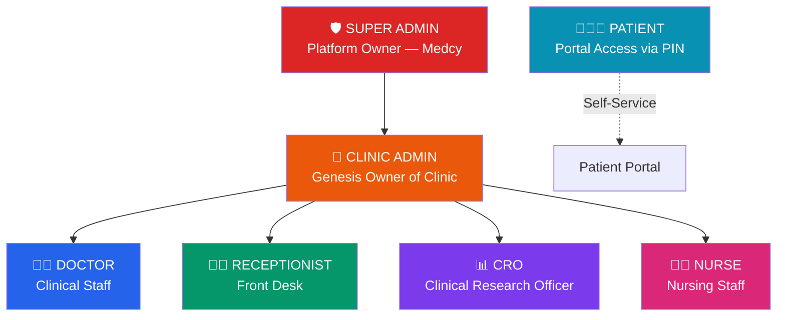
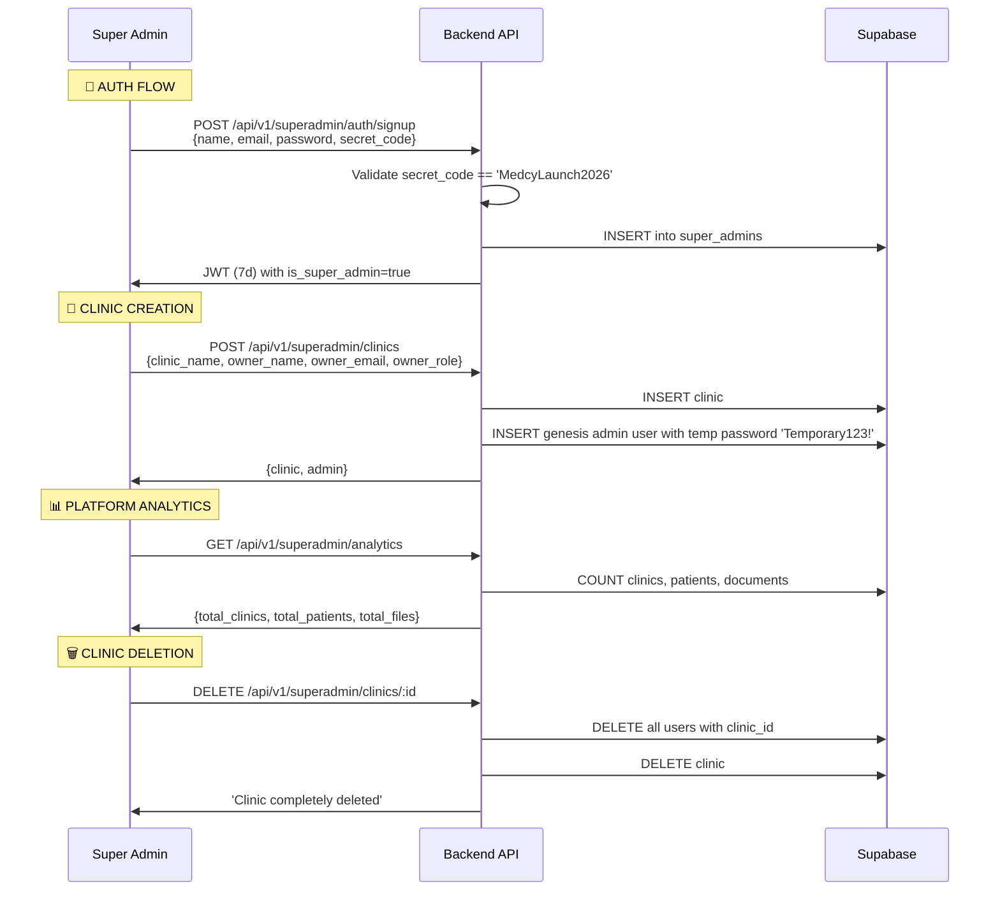
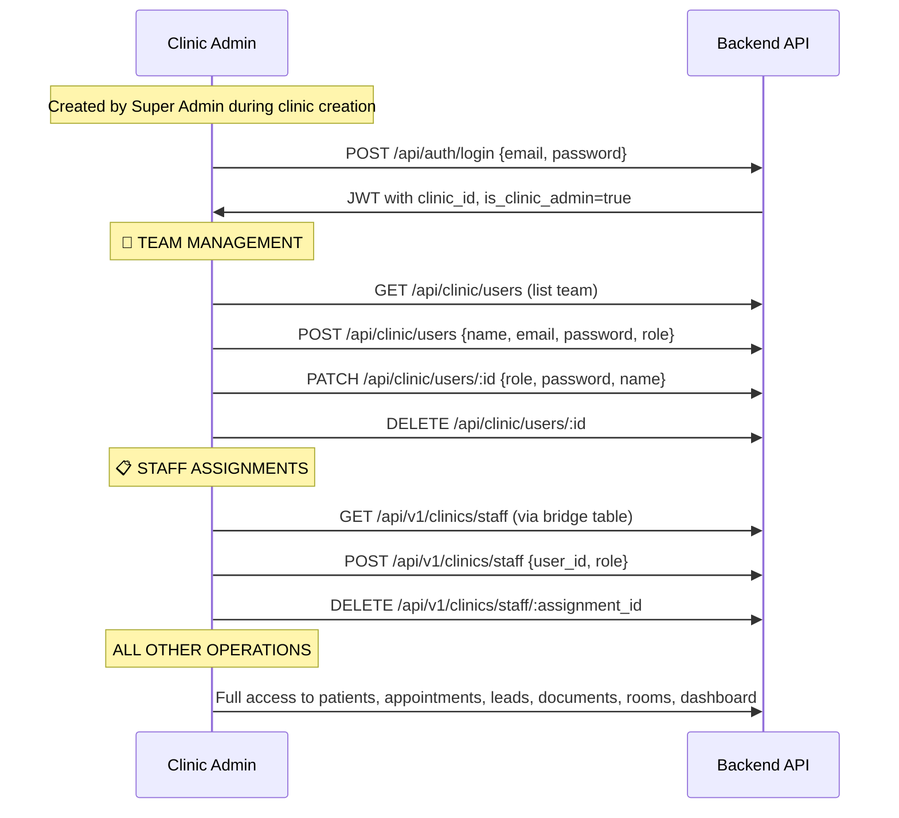
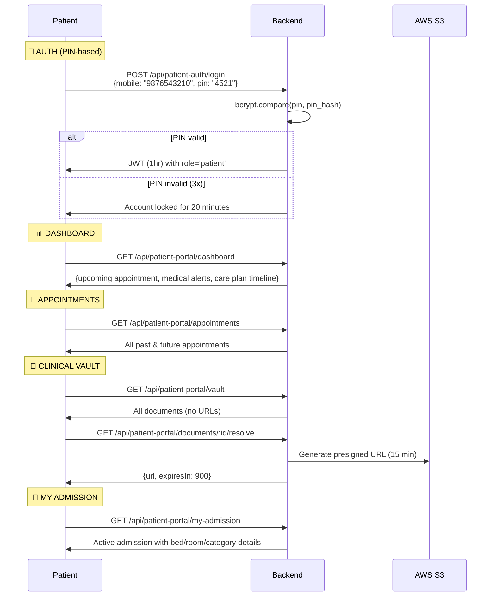
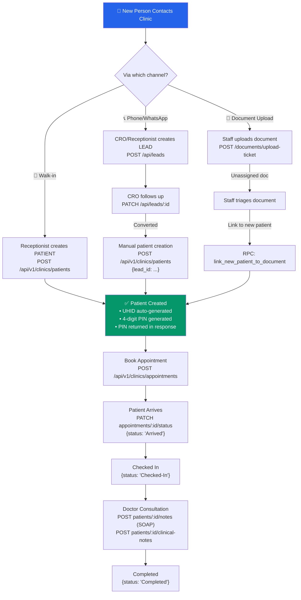
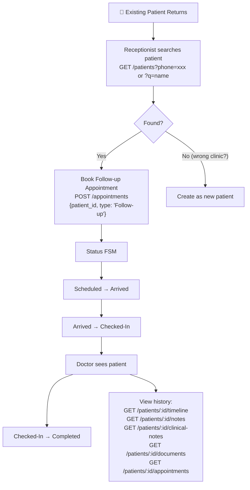
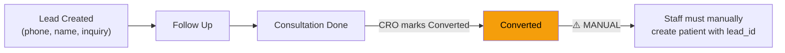

# 🔬 DFO Backend — Complete Critical System Audit

> **Audited**: 2026-07-17 | **Scope**: Every user role, every flow, every bug, every gap

---

## 📋 Table of Contents

1. [Complete User Role Hierarchy](#1-complete-user-role-hierarchy)
2. [Flow 1: Super Admin — Full Journey](#2-flow-1-super-admin)
3. [Flow 2: Clinic Admin — Full Journey](#3-flow-2-clinic-admin)
4. [Flow 3: Doctor — Full Journey](#4-flow-3-doctor)
5. [Flow 4: Receptionist — Full Journey](#5-flow-4-receptionist)
6. [Flow 5: CRO (Clinical Research Officer) — Full Journey](#6-flow-5-cro)
7. [Flow 6: Nurse — Full Journey](#7-flow-6-nurse)
8. [Flow 7: Patient Portal — Full Journey](#8-flow-7-patient-portal)
9. [Patient Management: New Patient Flow](#9-new-patient-complete-flow)
10. [Patient Management: Returning Patient Flow](#10-returning-patient-complete-flow)
11. [Lead → Patient Conversion Flow](#11-lead-to-patient-conversion)
12. [🚨 CRITICAL BUGS](#12-critical-bugs)
13. [⚠️ SECURITY VULNERABILITIES](#13-security-vulnerabilities)
14. [🔴 MISSING FEATURES (Blocking)](#14-missing-features-blocking)
15. [🟡 MISSING FEATURES (Important)](#15-missing-features-important)
16. [🟢 DESIGN DEBT & IMPROVEMENTS](#16-design-debt)
17. [Database Inconsistencies](#17-database-inconsistencies)

---

## 1. Complete User Role Hierarchy



| Role | Auth Route | Token TTL | Can Create Sub-Users | Tenant Scoped |
|:--|:--|:--|:--|:--|
| **Super Admin** | `POST /api/v1/superadmin/auth/login` | 7 days | ❌ (creates Clinic Admins via clinic creation) | ❌ Cross-tenant |
| **Clinic Admin** | `POST /api/auth/login` | 7 days | ✅ (Doctor, CRO, Receptionist, Nurse) | ✅ `clinic_id` |
| **Doctor** | `POST /api/auth/login` | 7 days | ❌ | ✅ `clinic_id` |
| **Receptionist** | `POST /api/auth/login` | 7 days | ❌ | ✅ `clinic_id` |
| **CRO** | `POST /api/auth/login` | 7 days | ❌ | ✅ `clinic_id` |
| **Nurse** | `POST /api/auth/login` | 7 days | ❌ | ✅ `clinic_id` |
| **Patient** | `POST /api/patient-auth/login` | 1 hour | ❌ | ❌ (no `clinic_id` in JWT) |

---

## 2. Flow 1: Super Admin



### Super Admin Capabilities:
- ✅ Signup with secret code
- ✅ Login
- ✅ Create clinics with genesis admin
- ✅ List all clinics with user counts
- ✅ View platform analytics (cached 5 min)
- ✅ Delete clinics (hard delete)

> [!CAUTION]
> ### Bugs & Gaps in Super Admin Flow
> 
> 1. **BUG: No clinic_id in Super Admin JWT** — Super Admin JWT has no `clinic_id`. When SuperAdmin accesses clinic-scoped endpoints (like via `UsersController` or `StaffController`), `TenantContext.getClinicId()` returns `undefined`, causing 400 errors. SuperAdmin bypass for tenant context is missing.
> 
> 2. **BUG: Clinic delete is NOT transactional** — Users are deleted first, THEN clinic. If clinic delete fails, users are already gone = orphaned clinic with no users.
> 
> 3. **BUG: Clinic delete doesn't cascade** — Only deletes `sakhi_clinic_users`. Does NOT delete: patients, appointments, documents, leads, clinical notes, room allocations, admissions, prescriptions, treatments. All become orphaned data.
> 
> 4. **MISSING: No clinic update/edit** — Cannot change clinic name, address, phone, email after creation. No `PATCH /api/v1/superadmin/clinics/:id`.
> 
> 5. **MISSING: No clinic deactivation** — `is_active` column exists on `clinics` table but there's no API to soft-deactivate a clinic. Only hard delete.
> 
> 6. **MISSING: No super admin password change** — No endpoint for super admin to change their own password.
> 
> 7. **MISSING: No super admin listing** — Cannot see all registered super admins.
> 
> 8. **SECURITY: Hardcoded secret code** — `'MedcyLaunch2026'` is hardcoded as fallback. Anyone who reads source code can create super admin accounts.
> 
> 9. **SECURITY: Genesis admin gets hardcoded temp password** — `'Temporary123!'` — No forced password change flow, no email notification. Admin could stay on this password forever.

---

## 3. Flow 2: Clinic Admin



### Clinic Admin Capabilities:
- ✅ Login via staff auth
- ✅ Create sub-users (Doctor, CRO, Receptionist, Nurse)
- ✅ Edit sub-users (role, password, name)
- ✅ Delete sub-users (cannot delete other admins)
- ✅ Staff bridge table assignments
- ✅ Full access to all clinic operations
- ✅ Profile update & password change

> [!WARNING]
> ### Bugs & Gaps in Clinic Admin Flow
> 
> 1. **BUG: Two parallel user management systems** — `UsersController` (`/api/clinic/users`) creates users in `sakhi_clinic_users` but does NOT create a corresponding `clinic_staff` bridge entry. `StaffController` (`/api/v1/clinics/staff`) only creates bridge entries. These two systems are disconnected. A user created via `/api/clinic/users` will NOT appear in `/api/v1/clinics/staff` listing.
> 
> 2. **BUG: User creation doesn't set `name` in DB** — [users.controller.ts:L109-L116](file:///e:/Medcy%20Health%20tech/DFO_Backend/control-tower-core/src/domains/clinics/controllers/users.controller.ts#L109-L116) — The insert payload includes `email, password_hash, role, clinic_id` but NOT `name`. The `name` field from the request body is never stored.
> 
> 3. **BUG: UsersController.listClinicUsers derives name from email** — [users.controller.ts:L64](file:///e:/Medcy%20Health%20tech/DFO_Backend/control-tower-core/src/domains/clinics/controllers/users.controller.ts#L64) — Instead of reading `name` from DB, it generates a fake name from email prefix. This is because the name was never saved (bug above).
> 
> 4. **MISSING: Cannot promote a user to Clinic Admin** — `allowedRoles` in update is `['Doctor', 'CRO', 'Receptionist', 'Nurse']` — No `Admin` role allowed. Clinic Admin cannot create another Clinic Admin.
> 
> 5. **MISSING: No user deactivation** — Only hard delete. The `is_active` column exists on `sakhi_clinic_users` but is never toggled. No soft-disable.
> 
> 6. **MISSING: No password reset email/notification** — When admin creates or updates a user's password, there's no mechanism to notify the user of their credentials.

---

## 4. Flow 3: Doctor

### What Doctors CAN do:
- ✅ Login, update profile, change password
- ✅ View all patients in their clinic
- ✅ Update patient records (`@Roles('Admin', 'Receptionist', 'Doctor')`)
- ✅ Create clinical notes (`@Roles('Admin', 'Doctor')`)
- ✅ Create structured SOAP notes (`@Roles('Admin', 'Doctor')`)
- ✅ View/create patient documents (`@Roles('Admin', 'Receptionist', 'Doctor', 'Nurse')`)
- ✅ View appointments, create appointments
- ✅ Double-booking prevention (global doctor availability check)
- ✅ Room allocation operations
- ✅ Patient timeline view

### What Doctors CANNOT do:
- ❌ Create/delete users
- ❌ Manage staff assignments
- ❌ No doctor-specific dashboard (sees CRO dashboard)

> [!NOTE]
> ### Gaps in Doctor Flow
> 
> 1. **MISSING: No prescription CRUD API** — `sakhi_clinic_prescriptions` table exists (migration 018) but there is NO controller endpoint to create, read, update, or delete prescriptions. The timeline view references it, but prescriptions can never be created.
> 
> 2. **MISSING: No treatment CRUD API** — `sakhi_clinic_treatments` table exists (migration 018) but NO controller endpoint. Same problem as prescriptions.
> 
> 3. **MISSING: No vitals CRUD API** — `patient_vitals` table is referenced in architecture docs but NO migration creates it, and NO API endpoint exists.
> 
> 4. **MISSING: No consent management API** — `patient_consents` table referenced in docs but NO migration and NO API.
> 
> 5. **MISSING: No clinical analysis API** — `clinical_analyses` table referenced in docs but NO migration and NO API.
> 
> 6. **MISSING: No doctor schedule/availability management** — Double-booking check exists but there's no way for a doctor to define their working hours, clinic availability, or block off-hours.

---

## 5. Flow 4: Receptionist

### What Receptionists CAN do:
- ✅ Login, update profile, change password
- ✅ View all patients
- ✅ Create new patients (generates UHID + PIN)
- ✅ Update patient records (`@Roles('Admin', 'Receptionist', 'Doctor')`)
- ✅ Create appointments for patients/leads
- ✅ Update appointment status (Arrived, Checked-In, etc.)
- ✅ Upload patient documents
- ✅ View leads
- ✅ Create leads
- ✅ View dashboard summary

### What Receptionists CANNOT do:
- ❌ Create clinical notes (Doctor/Admin only)
- ❌ Create SOAP notes (Doctor/Admin only)
- ❌ Create/delete users
- ❌ Manage staff

> [!NOTE]
> ### Gaps in Receptionist Flow
> 
> 1. **MISSING: No check-in kiosk flow** — When patient arrives, receptionist manually changes status. No queue management, no waiting room display, no token/queue number system.
> 
> 2. **MISSING: No walk-in patient flow** — All appointments require explicit creation. No streamlined "walk-in" pathway that auto-creates appointment + marks as arrived.
> 
> 3. **MISSING: No patient search by UHID** — Patient search only works by `phone` or `name/mobile`. UHID (the hospital ID) is not searchable despite being auto-generated.
> 
> 4. **MISSING: No billing/invoice integration** — Receptionist has no way to generate bills or link to a billing system.

---

## 6. Flow 5: CRO (Clinical Research Officer)

### What CROs CAN do:
- ✅ Login, update profile
- ✅ View leads
- ✅ Create leads
- ✅ Update lead status (Follow Up, Converted, etc.)
- ✅ Bulk import leads
- ✅ Export leads to CSV
- ✅ Re-engage stalled leads
- ✅ View CRO dashboard (KPIs, funnel, intervention queue)

### What CROs CANNOT do:
- ❌ Create patients directly
- ❌ Create clinical notes
- ❌ Access room management
- ❌ Manage staff

> [!WARNING]
> ### Bugs & Gaps in CRO Flow
> 
> 1. **BUG: Leads queries have NO tenant isolation** — [leads.controller.ts:L37](file:///e:/Medcy%20Health%20tech/DFO_Backend/control-tower-core/src/domains/clinics/controllers/leads.controller.ts#L37) — `list()` does NOT filter by `clinic_id`! A CRO from Clinic A can see ALL leads across ALL clinics. Same for `exportCsv()`, `bulkCreate()`.
> 
> 2. **BUG: Dashboard queries have NO tenant isolation** — [dashboard.controller.ts:L18-L31](file:///e:/Medcy%20Health%20tech/DFO_Backend/control-tower-core/src/domains/clinics/controllers/dashboard.controller.ts#L18-L31) — `getSummary()` fetches ALL appointments and ALL leads across ALL clinics. No `clinic_id` filter.
> 
> 3. **BUG: Dashboard has NO auth guard** — [dashboard.controller.ts:L8](file:///e:/Medcy%20Health%20tech/DFO_Backend/control-tower-core/src/domains/clinics/controllers/dashboard.controller.ts#L8) — `@Controller('api/dashboard')` has NO `@UseGuards`. Anyone without a token can access it.
> 
> 4. **BUG: Lead create doesn't enforce clinic_id** — [leads.controller.ts:L68-L77](file:///e:/Medcy%20Health%20tech/DFO_Backend/control-tower-core/src/domains/clinics/controllers/leads.controller.ts#L68-L77) — The `create()` payload does NOT include `clinic_id`. Leads are created without tenant binding.
> 
> 5. **MISSING: No lead-to-patient conversion endpoint** — CRO can update lead status to "Converted" but there's no atomic API to convert a lead into a patient record. This has to be done manually.

---

## 7. Flow 6: Nurse

### What Nurses CAN do:
- ✅ Login, update profile
- ✅ View all patients
- ✅ Upload patient documents (`@Roles('Admin', 'Receptionist', 'Doctor', 'Nurse')`)
- ✅ View appointments

### What Nurses CANNOT do:
- ❌ Create patients
- ❌ Update patient records (not in `@Roles('Admin', 'Receptionist', 'Doctor')`)
- ❌ Create clinical notes
- ❌ Create appointments

> [!IMPORTANT]
> ### Gaps in Nurse Flow
> 
> 1. **MISSING: No vitals recording** — The architecture mentions `patient_vitals` table but it doesn't exist. Nurses have no way to record BP, temperature, weight, heart rate — which is their PRIMARY job.
> 
> 2. **MISSING: Nurses can't update patients** — The `@Roles('Admin', 'Receptionist', 'Doctor')` on patient update explicitly excludes Nurses. Nurses need to at least update basic info.
> 
> 3. **MISSING: No nursing notes** — Only "clinical notes" exist, which are Doctor/Admin only. No mechanism for nursing observations.

---

## 8. Flow 7: Patient Portal



### Patient Portal Capabilities:
- ✅ PIN-based login with bcrypt
- ✅ Account lockout after 3 failed attempts (20 min)
- ✅ Dashboard with next appointment
- ✅ View all appointments
- ✅ Clinical vault with on-demand presigned URLs
- ✅ Active admission view
- ✅ Cross-patient access prevention on documents

> [!CAUTION]
> ### Bugs & Gaps in Patient Portal
> 
> 1. **BUG: Documents endpoint queries wrong table** — [patient-portal.controller.ts:L123](file:///e:/Medcy%20Health%20tech/DFO_Backend/control-tower-core/src/domains/clinics/controllers/patient-portal.controller.ts#L123) — Queries `sakhi_documents` (table doesn't exist) instead of `sakhi_clinic_documents`. This endpoint will always fail with a Supabase error.
> 
> 2. **BUG: Dashboard queries `appointment_time` column** — [patient-portal.controller.ts:L49](file:///e:/Medcy%20Health%20tech/DFO_Backend/control-tower-core/src/domains/clinics/controllers/patient-portal.controller.ts#L49) — Orders by `appointment_time` but the table uses `start_time`. This query will fail.
> 
> 3. **BUG: My-Admission queries non-existent columns** — [patient-portal.controller.ts:L155](file:///e:/Medcy%20Health%20tech/DFO_Backend/control-tower-core/src/domains/clinics/controllers/patient-portal.controller.ts#L155) — Queries `attending_doctor_id` and `sakhi_clinic_rooms.name` and `sakhi_clinic_room_categories.tier` — none of these columns exist in the schema. The admissions table has `admitting_doctor_id` not `attending_doctor_id`. Rooms don't have `name`. Categories don't have `tier`.
> 
> 4. **BUG: My-Admission queries wrong table for doctor** — [patient-portal.controller.ts:L183](file:///e:/Medcy%20Health%20tech/DFO_Backend/control-tower-core/src/domains/clinics/controllers/patient-portal.controller.ts#L183) — Queries `sakhi_staff` (doesn't exist) instead of `sakhi_clinic_users`.
> 
> 5. **BUG: `resolveDocumentUrl` uses `@Param` but route is a `@Get`** — [patient-portal.controller.ts:L249-L250](file:///e:/Medcy%20Health%20tech/DFO_Backend/control-tower-core/src/domains/clinics/controllers/patient-portal.controller.ts#L249-L250) — The `@Get('documents/:id/resolve')` endpoint uses `@Param('id')` but `Param` is not imported in the controller's import statement. This will throw a runtime error.
> 
> 6. **BUG: Patient JWT has NO `clinic_id`** — [patient-auth.controller.ts:L97-L108](file:///e:/Medcy%20Health%20tech/DFO_Backend/control-tower-core/src/domains/clinics/controllers/patient-auth.controller.ts#L97-L108) — The patient JWT does not contain `clinic_id`. Patient queries in the portal don't scope by clinic. A patient with the same mobile in two clinics would authenticate against the first match (`.single()`), potentially leaking data from the wrong clinic.
> 
> 7. **BUG: Care plan timeline is hardcoded** — [patient-portal.controller.ts:L83-L87](file:///e:/Medcy%20Health%20tech/DFO_Backend/control-tower-core/src/domains/clinics/controllers/patient-portal.controller.ts#L83-L87) — Returns static hardcoded data for every patient.
> 
> 8. **MISSING: No patient self-booking** — Patient can view appointments but CANNOT book, reschedule, or cancel appointments.
> 
> 9. **MISSING: No patient PIN change** — Patient cannot change their own PIN. Only clinic staff can reset via `/patients/:id/reset-pin`.
> 
> 10. **MISSING: No patient profile view/edit** — Patient cannot view or update their own profile (address, emergency contact, etc.).

---

## 9. New Patient Complete Flow



### Step-by-step for New Patient Walk-in:

| Step | Who | API | What Happens |
|:--|:--|:--|:--|
| 1 | Receptionist | `POST /api/v1/clinics/patients` | Creates patient, auto-generates UHID (e.g., `UHID-20260717-001`), generates 4-digit PIN, hashes with bcrypt |
| 2 | System | — | Returns `generatedPin` in response (receptionist gives this to patient verbally) |
| 3 | Receptionist | `POST /api/v1/clinics/appointments` | Books appointment with doctor, validates no double-booking |
| 4 | Receptionist | `PATCH /appointments/:id/status` | Marks `status: 'Arrived'` when patient physically arrives |
| 5 | Receptionist | `PATCH /appointments/:id/status` | Marks `status: 'Checked-In'` |
| 6 | Doctor | `POST /patients/:id/notes` | Creates SOAP note (subjective/objective/assessment/plan) |
| 7 | Doctor | — | ⚠️ **CANNOT prescribe** — no prescription API exists |
| 8 | Doctor | — | ⚠️ **CANNOT order treatments** — no treatment API exists |
| 9 | Nurse | — | ⚠️ **CANNOT record vitals** — no vitals API exists |
| 10 | Receptionist | `PATCH /appointments/:id/status` | Marks `status: 'Completed'` |

---

## 10. Returning Patient Complete Flow



### Appointment Status State Machine:

```
Scheduled → Arrived → Checked-In → Completed
    ↓                                    
Canceled (terminal, immutable)
```

> [!WARNING]
> **State machine has gaps:**
> - `Expected` status exists in allowed list but has no defined transitions
> - `No Show` is checked as terminal in update (`['Completed', 'Canceled', 'No Show']`) but is NOT in `allowedStatuses` array — so it can never be set!
> - No `Rescheduled` status
> - No explicit transition validation (can go from `Scheduled` directly to `Completed`, skipping Arrived/Checked-In)

---

## 11. Lead → Patient Conversion



> [!CAUTION]
> **The lead → patient conversion is completely manual.** There is no:
> - Atomic conversion endpoint
> - Auto-linking of lead data to patient record
> - Notification when lead is converted
> - Validation that the patient was actually created from the lead
> 
> The `lead_id` column on `sakhi_clinic_patients` is set manually by the frontend. If forgotten, the connection is lost forever.

---

## 12. 🚨 CRITICAL BUGS

| # | Severity | Location | Bug |
|:--|:--|:--|:--|
| 1 | 🔴 **CRITICAL** | [leads.controller.ts](file:///e:/Medcy%20Health%20tech/DFO_Backend/control-tower-core/src/domains/clinics/controllers/leads.controller.ts) | **Zero tenant isolation on leads** — `list()`, `create()`, `bulkCreate()`, `exportCsv()` do NOT filter by `clinic_id`. Cross-tenant data leak. |
| 2 | 🔴 **CRITICAL** | [dashboard.controller.ts](file:///e:/Medcy%20Health%20tech/DFO_Backend/control-tower-core/src/domains/clinics/controllers/dashboard.controller.ts) | **Zero auth + zero tenant isolation** — No `@UseGuards`, no `clinic_id` filter. Anyone can see all clinics' data unauthenticated. |
| 3 | 🔴 **CRITICAL** | [patient-portal.controller.ts:L123](file:///e:/Medcy%20Health%20tech/DFO_Backend/control-tower-core/src/domains/clinics/controllers/patient-portal.controller.ts#L123) | **Wrong table name** — Queries `sakhi_documents` instead of `sakhi_clinic_documents`. Endpoint is broken. |
| 4 | 🔴 **CRITICAL** | [patient-portal.controller.ts:L49](file:///e:/Medcy%20Health%20tech/DFO_Backend/control-tower-core/src/domains/clinics/controllers/patient-portal.controller.ts#L49) | **Wrong column name** — `appointment_time` doesn't exist, should be `start_time`. |
| 5 | 🔴 **CRITICAL** | [patient-portal.controller.ts:L155-L183](file:///e:/Medcy%20Health%20tech/DFO_Backend/control-tower-core/src/domains/clinics/controllers/patient-portal.controller.ts#L155-L183) | **My-Admission references non-existent columns** — `attending_doctor_id`, `rooms.name`, `categories.tier`, `sakhi_staff` table. All wrong. |
| 6 | 🔴 **CRITICAL** | [patient-portal.controller.ts:L249-L250](file:///e:/Medcy%20Health%20tech/DFO_Backend/control-tower-core/src/domains/clinics/controllers/patient-portal.controller.ts#L249-L250) | **`@Param` decorator not imported** — `resolveDocumentUrl` will throw at runtime. Missing import. |
| 7 | 🟠 **HIGH** | [users.controller.ts:L109-L116](file:///e:/Medcy%20Health%20tech/DFO_Backend/control-tower-core/src/domains/clinics/controllers/users.controller.ts#L109-L116) | **User name never saved** — `name` from request body not included in INSERT payload. |
| 8 | 🟠 **HIGH** | [patient-auth.controller.ts:L97-L108](file:///e:/Medcy%20Health%20tech/DFO_Backend/control-tower-core/src/domains/clinics/controllers/patient-auth.controller.ts#L97-L108) | **Patient JWT missing `clinic_id`** — Multi-clinic patients could see wrong clinic's data. |
| 9 | 🟠 **HIGH** | [super-admin.controller.ts:L160-L190](file:///e:/Medcy%20Health%20tech/DFO_Backend/control-tower-core/src/domains/clinics/controllers/super-admin.controller.ts#L160-L190) | **Non-transactional clinic deletion** — Users deleted before clinic, if clinic delete fails = orphaned clinic. |
| 10 | 🟠 **HIGH** | [appointments.controller.ts:L14](file:///e:/Medcy%20Health%20tech/DFO_Backend/control-tower-core/src/domains/clinics/controllers/appointments.controller.ts#L14) | **`No Show` in terminal check but NOT in allowedStatuses** — Can never be set but blocks updates if somehow present. |

---

## 13. ⚠️ SECURITY VULNERABILITIES

| # | Risk | Location | Issue |
|:--|:--|:--|:--|
| 1 | 🔴 | All auth controllers | **`password-hash` library used with `require()` at runtime** — Not a standard dependency. Uses try/catch with plaintext fallback. If library not installed, passwords are stored/compared in plaintext. |
| 2 | 🔴 | [super-admin-auth.controller.ts:L51-L53](file:///e:/Medcy%20Health%20tech/DFO_Backend/control-tower-core/src/domains/clinics/controllers/super-admin-auth.controller.ts#L51-L53) | **Plaintext password fallback** — `if (user.password_hash === password) isMatch = true` — Any user whose password was stored in plaintext can login. This is a dev backdoor left in production code. |
| 3 | 🔴 | Same pattern in [auth.controller.ts:L59](file:///e:/Medcy%20Health%20tech/DFO_Backend/control-tower-core/src/domains/clinics/controllers/auth.controller.ts#L59), [patient-auth.controller.ts:L68](file:///e:/Medcy%20Health%20tech/DFO_Backend/control-tower-core/src/domains/clinics/controllers/patient-auth.controller.ts#L68) | **Plaintext password fallback exists in ALL auth flows** — Staff login, patient login all have `if (hash === password) isMatch = true`. |
| 4 | 🔴 | [super-admin-auth.controller.ts:L18](file:///e:/Medcy%20Health%20tech/DFO_Backend/control-tower-core/src/domains/clinics/controllers/super-admin-auth.controller.ts#L18) | **Hardcoded super admin secret** — `'MedcyLaunch2026'` hardcoded as fallback. |
| 5 | 🟠 | All guards | **`'fallback_secret_do_not_use_in_prod'`** used as JWT secret fallback in ALL guards: [clinics-auth.guard.ts:L11](file:///e:/Medcy%20Health%20tech/DFO_Backend/control-tower-core/src/domains/clinics/guards/clinics-auth.guard.ts#L11), [super-admin.guard.ts:L11](file:///e:/Medcy%20Health%20tech/DFO_Backend/control-tower-core/src/domains/clinics/guards/super-admin.guard.ts#L11), [auth.controller.ts:L21](file:///e:/Medcy%20Health%20tech/DFO_Backend/control-tower-core/src/domains/clinics/controllers/auth.controller.ts#L21). If `JWT_SECRET` env var is missing, entire system runs on a known secret. |
| 6 | 🟠 | [dashboard.controller.ts](file:///e:/Medcy%20Health%20tech/DFO_Backend/control-tower-core/src/domains/clinics/controllers/dashboard.controller.ts) | **No authentication at all** — Dashboard endpoints are completely public. |
| 7 | 🟠 | [auth.controller.ts:L28](file:///e:/Medcy%20Health%20tech/DFO_Backend/control-tower-core/src/domains/clinics/controllers/auth.controller.ts#L28) | **Email logged on every login attempt** — `Login attempt: email="${email}"` — PII in logs. |
| 8 | 🟡 | [auth.controller.ts:L118-L123](file:///e:/Medcy%20Health%20tech/DFO_Backend/control-tower-core/src/domains/clinics/controllers/auth.controller.ts#L118-L123) | **Stateless logout = no JWT invalidation** — Stolen tokens remain valid for 7 days. No token blacklist. |
| 9 | 🟡 | [leads.controller.ts:L40](file:///e:/Medcy%20Health%20tech/DFO_Backend/control-tower-core/src/domains/clinics/controllers/leads.controller.ts#L40) | **SQL injection risk via `ilike`** — `.or(\`name.ilike.%${q}%\`)` — User-supplied `q` is directly interpolated into the query filter string. |
| 10 | 🟡 | [patients.controller.ts:L38](file:///e:/Medcy%20Health%20tech/DFO_Backend/control-tower-core/src/domains/clinics/controllers/patients.controller.ts#L38) | **Same SQL injection risk** — `.or(\`name.ilike.%${q}%,mobile.ilike.%${q}%\`)` |

---

## 14. 🔴 MISSING FEATURES (Blocking for Production)

| # | Feature | Impact |
|:--|:--|:--|
| 1 | **Prescription CRUD** | Doctors cannot prescribe medications. Table exists, no API. |
| 2 | **Treatment/Procedure CRUD** | Cannot track treatments or procedures. Table exists, no API. |
| 3 | **Vitals Recording** | Nurses/Doctors cannot record BP, temperature, weight. No table, no API. |
| 4 | **Lead → Patient Conversion** | No atomic conversion. Manual and error-prone. |
| 5 | **Tenant isolation on Leads** | Complete data leak across clinics. |
| 6 | **Tenant isolation on Dashboard** | Complete data leak across clinics. |
| 7 | **Dashboard authentication** | Public endpoint exposing all clinical data. |
| 8 | **Consent management** | Healthcare compliance requirement. No implementation. |
| 9 | **Appointment Notifications** | No SMS/WhatsApp/email notifications for appointments. Reminder queue exists but no consumer. |
| 10 | **Password hashing consistency** | Mixed use of `password-hash` and `bcrypt`. `password-hash` is `require()`d inline with plaintext fallback. |

---

## 15. 🟡 MISSING FEATURES (Important but not blocking)

| # | Feature | Notes |
|:--|:--|:--|
| 1 | Patient self-service booking | Portal is read-only |
| 2 | Patient PIN self-change | Only staff can reset |
| 3 | Patient profile view/edit | Patient can't see/update own info |
| 4 | Doctor schedule management | No working hours, breaks, leave management |
| 5 | Queue/Token management | No waiting room management system |
| 6 | Walk-in express flow | No streamlined walk-in pathway |
| 7 | Clinic update/deactivate | Cannot edit clinic after creation |
| 8 | User deactivation | Only hard delete, no soft-disable |
| 9 | Forgot password flow | No self-service password recovery for staff |
| 10 | Email/SMS notifications | No notification system for any event |
| 11 | Patient search by UHID | UHID generated but not searchable |
| 12 | Billing/Invoice | No billing module |
| 13 | Multi-doctor per appointment | Only one doctor per appointment |
| 14 | Appointment rescheduling | No reschedule flow; only update date/time |
| 15 | Patient merge/dedup | Duplicate patients by phone across manual creation |
| 16 | Audit trail for patient portal | No data access audit when patient views own data |

---

## 16. 🟢 DESIGN DEBT & IMPROVEMENTS

| # | Issue | Recommendation |
|:--|:--|:--|
| 1 | **Two user management systems** | Unify `UsersController` and `StaffController`. Choose one approach — either direct `sakhi_clinic_users` or bridge `clinic_staff`. |
| 2 | **Inconsistent password hashing** | Standardize on `bcrypt` (already used for patient PINs). Remove `password-hash` library entirely. |
| 3 | **`require()` inline imports** | `password-hash` is `require()`d inline inside try-catch in 6+ places. Should be a proper import or removed. |
| 4 | **Token returned in two places** | [auth.controller.ts:L102-L109](file:///e:/Medcy%20Health%20tech/DFO_Backend/control-tower-core/src/domains/clinics/controllers/auth.controller.ts#L102-L109) — Login response has `token` at top level AND inside `data.token`. Pick one. |
| 5 | **No DTO validation on most endpoints** | Only `CreateClinicDto` and `RoomAllocationDto` have DTOs. All other endpoints accept raw `any` body with no validation. |
| 6 | **No test coverage** | Zero unit tests. Only ad-hoc `.js` and `.ps1` scripts. |
| 7 | **Multiple `main.ts` entry points** | 5 different main files (`main.ts`, `main-minimal.ts`, `main-super-minimal.ts`, `main-tiny.ts`, `janmasethu-only.main.ts`). Unclear which is production. |
| 8 | **Schema inconsistency** | `sakhi_clinical_notes` (has `note` column), vs `sakhi_clinic_patient_notes` (also has `note` column) — Two separate notes tables. |
| 9 | **Appointment controller has no auth guard** | [appointments.controller.ts:L10](file:///e:/Medcy%20Health%20tech/DFO_Backend/control-tower-core/src/domains/clinics/controllers/appointments.controller.ts#L10) — No `@UseGuards(ClinicsAuthGuard)` at class level. Relies on `TenantContext` but doesn't enforce authentication! |
| 10 | **Mixed role casing** | Some places use `'Doctor'`, others `'Admin'`, `'Superadmin'`, `'DOCTOR'`, `'admin'`. Case-insensitive comparison in RolesGuard helps but it's fragile. |

---

## 17. Database Inconsistencies

| Issue | Details |
|:--|:--|
| **Missing tables referenced in code** | `patient_vitals`, `patient_consents`, `clinical_analyses` — All mentioned in architecture docs but have NO migration and NO table creation. |
| **Duplicate notes tables** | `sakhi_clinic_patient_notes` (simple text notes) AND `sakhi_clinical_notes` (SOAP notes) — Two separate note systems with overlapping purpose. |
| **`sakhi_clinical_notes` missing migration** | There is NO migration file that creates this table. It must have been created manually or is referenced but doesn't exist. |
| **`sakhi_clinic_patient_notes` missing migration** | Same — no migration creates this table. |
| **No `patient_timeline_view` dependency check** | The timeline view (018) references `sakhi_clinical_notes` which may not exist. |
| **Room categories schema mismatch** | Code queries `sakhi_clinic_room_categories.tier` but the schema has no `tier` column (only `name`, `description`, `daily_rate`, `is_active`). |
| **Rooms schema mismatch** | Code queries `sakhi_clinic_rooms.name` but the schema has no `name` column (only `room_number`, `floor`, `capacity`). |
| **Migration numbering gap** | Goes from 015 → 016 → 017 → 018 but 016-017 add room transfer features not referenced in controllers. |
