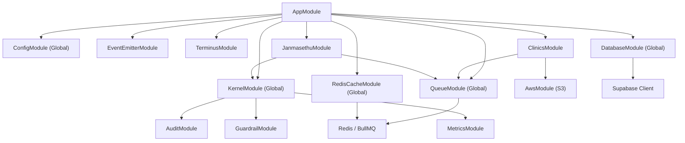
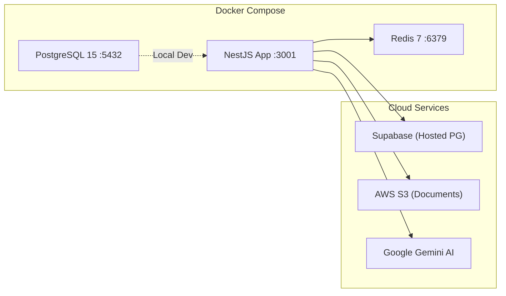
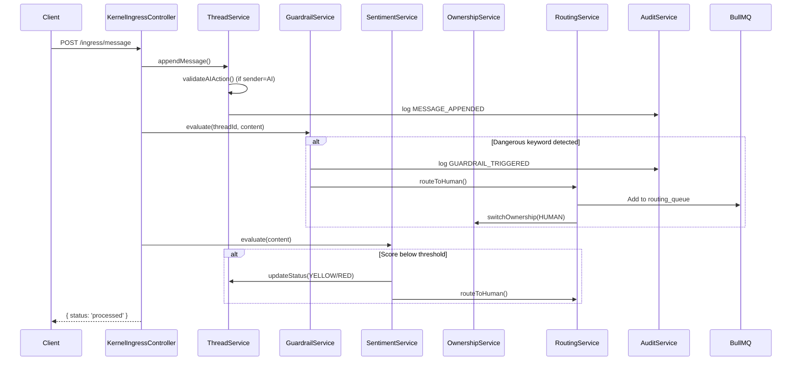

# Patient management — System Architecture Document

> **Version**: 1.0  
> **Last Updated**: 2026-07-01  
> **System**: patient management

---

## 1. Executive Summary

The **DFO Backend** (Digital Front Office) is a **multi-tenant clinical operating system** built on a **modular monolith** architecture using NestJS (TypeScript). It serves as the centralized control tower for the **JanmaSethu** maternal healthcare platform and the **Sakhi Clinics** multi-tenant clinic management system.

The system manages patient journeys, clinical consultations, AI-to-Human thread handoffs, document management, room allocation, lead CRM, and real-time analytics — all within a healthcare-grade security and compliance framework.

---

## 2. High-Level Architecture

```
┌──────────────────────────────────────────────────────────────────┐
│                        CLIENT LAYER                              │
│   Web Frontends · Mobile Apps · WhatsApp Integration · APIs      │
└─────────────────────────────┬────────────────────────────────────┘
                              │ HTTPS (JWT Bearer)
                              ▼
┌──────────────────────────────────────────────────────────────────┐
│                    NestJS APPLICATION (Port 3000)                 │
│ ┌──────────────┐ ┌──────────────┐ ┌───────────────────────────┐ │
│ │  API Layer   │ │ Interceptors │ │  Global Filters & Guards  │ │
│ │ Controllers  │ │  (Tenant)    │ │  (Helmet, ValidationPipe) │ │
│ └──────┬───────┘ └──────┬───────┘ └─────────────┬─────────────┘ │
│        │                │                        │               │
│ ┌──────▼────────────────▼────────────────────────▼──────────┐   │
│ │                     KERNEL MODULE                          │   │
│ │  ThreadService · OwnershipService · RoutingService         │   │
│ │  SentimentService · GuardrailService · AuditService        │   │
│ │  MetricsService · RateLimiterService · ProviderRegistry    │   │
│ └────────────────────────┬───────────────────────────────────┘   │
│                          │                                       │
│ ┌────────────────────────▼───────────────────────────────────┐   │
│ │                    DOMAIN MODULES                           │   │
│ │  ┌──────────────────┐    ┌──────────────────────────────┐  │   │
│ │  │  Clinics Module  │    │    JanmaSethu Module         │  │   │
│ │  │  (Multi-Tenant)  │    │    (Maternal Healthcare)     │  │   │
│ │  └──────────────────┘    └──────────────────────────────┘  │   │
│ └────────────────────────────────────────────────────────────┘   │
│                                                                  │
│ ┌────────────────────────────────────────────────────────────┐   │
│ │                  INFRASTRUCTURE LAYER                       │   │
│ │  DatabaseModule · QueueModule · RedisCacheModule            │   │
│ │  AwsModule (S3) · EventEmitter · Security · Filters        │   │
│ └─────┬──────────────┬─────────────────────┬─────────────────┘   │
└───────┼──────────────┼─────────────────────┼─────────────────────┘
        │              │                     │
        ▼              ▼                     ▼
  ┌──────────┐  ┌──────────┐          ┌──────────┐
  │ Supabase │  │  Redis   │          │ AWS S3   │
  │ Postgres │  │ (BullMQ) │          │ Storage  │
  └──────────┘  └──────────┘          └──────────┘
```

---

## 3. Architectural Principles

| Principle | Implementation |
|:---|:---|
| **Modular Monolith** | Kernel is domain-agnostic; domain modules (Clinics, JanmaSethu) plug in via contracts/interfaces. |
| **Multi-Tenancy** | `clinic_id` on every clinical data table. `TenantInterceptor` extracts tenant from JWT on every request. `TenantContext` uses `AsyncLocalStorage` for request-scoped tenant isolation. |
| **Optimistic Concurrency** | `version` field on `conversation_threads`. Atomic updates use `WHERE id = ? AND version = ?`. |
| **AI Suppression** | Defense-in-depth: `AISuppressionGuard` (HTTP layer) + `ThreadService.validateAIAction()` (service layer). AI is suppressed when thread is YELLOW/RED, HUMAN-owned, or locked. |
| **Event-Driven Side Effects** | BullMQ queues (`routing_queue`, `engagement_queue`, `reminder_queue`, `dfo_events_queue`) decouple command processing from side effects like audit logging, cache invalidation, and notifications. |
| **Security-First** | Helmet middleware, CORS, JWT auth (7-day for staff, 1-hour for patients), RBAC via decorators, AES-256 PII encryption, bcrypt PIN hashing, cross-tenant access guards. |

---

## 4. Module Dependency Graph



---

## 5. Layer Breakdown

### 5.1 API Layer (`src/api/`)

| Controller | Route Prefix | Purpose |
|:---|:---|:---|
| `ThreadController` | `/thread` | Core thread CRUD, status listing, message operations |
| `HealthController` | `/health` | Kubernetes/load-balancer health probes |
| `DebugController` | `/debug` | Development diagnostics |
| `KernelIngressController` | `/ingress` | Universal message ingestion endpoint |

### 5.2 Kernel Module (`src/kernel/`)

The domain-agnostic orchestration engine. Provides:

| Service | Responsibility |
|:---|:---|
| `ThreadService` | Thread lifecycle (init, get, status update, message append), AI suppression enforcement |
| `OwnershipService` | Atomic AI ↔ HUMAN ownership transitions with version-checked concurrency |
| `RoutingService` | BullMQ-backed human agent routing queue, dead-letter handling |
| `SentimentService` | Pluggable sentiment evaluation via `SentimentProvider` contract |
| `GuardrailService` | Regex/keyword scanning for dangerous content; auto-escalation |
| `AuditService` | Immutable audit log creation for every state transition |
| `MetricsService` | Concurrency conflict counting, ownership switch metrics |
| `RateLimiterService` | Request throttling |
| `ProviderRegistry` | Multi-domain plugin registration for sentiment, escalation, notifications |

### 5.3 Domain: Clinics Module (`src/domains/clinics/`)

Multi-tenant clinic management with 17 controllers:

| Controller | Route Prefix | Domain |
|:---|:---|:---|
| `AuthController` | `api/auth` | Staff JWT login/logout, profile update, password change |
| `SuperAdminAuthController` | `api/v1/superadmin/auth` | Super admin login/signup with secret code |
| `SuperAdminController` | `api/v1/superadmin` | Clinic CRUD, platform analytics, clinic deletion |
| `PatientAuthController` | `api/patient-auth` | Patient PIN-based login with lockout |
| `PatientPortalController` | `api/patient-portal` | Patient dashboard, appointments, clinical vault |
| `PatientsController` | `api/v1/clinics/patients` | Full patient CRUD, clinical notes, documents, PIN reset |
| `AppointmentsController` | `api/v1/clinics/appointments` | Scheduling with double-booking prevention, status FSM |
| `DocumentsController` | `api/v1/clinics/documents` | S3 upload tickets, register, link/unlink, triage queue |
| `LeadsController` | `api/leads` | CRM lead management, bulk import, CSV export |
| `StaffController` | `api/v1/clinics/staff` | Staff assignment via bridge table, Redis caching |
| `RoomAllocationController` | `api/v1/clinics` | Room categories, rooms, beds, admissions, transfers |
| `DashboardController` | `api/dashboard` | Summary dashboard, CRO funnel analytics |
| `AuditController` | — | Data access audit trail |
| `ControlTowerController` | — | Thread management from clinic context |
| `UsersController` | — | User management |
| `KnowledgeController` | — | Knowledge base |
| `InternalAssistantController` | — | AI assistant integration |

### 5.4 Domain: JanmaSethu Module (`src/domains/janmasethu/`)

Maternal healthcare domain with specialized services:

| Service | Responsibility |
|:---|:---|
| `JanmasethuHandler` | Message processing pipeline |
| `JanmasethuRepository` | All Supabase data access (28KB — largest file) |
| `JanmasethuAssignmentService` | Thread auto-assignment with workload balancing |
| `JanmasethuTakeoverService` | Human clinician takeover flow |
| `JanmasethuContextService` | Full thread context aggregation |
| `JanmasethuDFOService` | Patient journey, consultations, prescriptions, analytics |
| `JanmasethuLeadsService` | Lead CRM, stalled lead processing, lead-to-patient conversion |
| `JanmasethuSummaryService` | AI-powered consultation summaries |
| `JanmasethuReportingService` | Patient journey reports |
| `JanmasethuAuditService` | PII access logging, clinical update auditing |
| `JanmasethuRbacService` | Permission checks per role |
| `JanmasethuSlaService` | SLA enforcement (Nurse: 3-10 min, Doctor: 5 min) |
| `JanmasethuEncryptionService` | AES-256 PII encryption/decryption |
| `JanmasethuFeedbackService` | Clinician feedback on AI accuracy |
| `ClinicalIntelligenceService` | Gemini AI-powered conversation analysis |
| `DocumentService` | Clinical document generation (DOCX via Puppeteer) |
| `EngagementEngineService` | Proactive patient engagement |
| `AppointmentService` | Maternal-specific appointment handling |
| `RiskEngineService` | Patient risk assessment |
| `AlertingService` | Clinical alerting |

### 5.5 Infrastructure Layer (`src/infrastructure/`)

| Component | Technology | Purpose |
|:---|:---|:---|
| `DatabaseModule` | Supabase (PostgreSQL) | Global Supabase client injection |
| `QueueModule` | BullMQ + Redis | 4 named queues for async processing |
| `RedisCacheModule` | ioredis | Staff list caching, analytics cache |
| `AwsModule` | AWS S3 SDK | Presigned upload/download URLs, file deletion |
| `TenantInterceptor` | AsyncLocalStorage | Request-scoped tenant context from JWT |
| `TenantContext` | AsyncLocalStorage | Static getters for `clinic_id`, `user_id`, `role` |
| `AISuppressionGuard` | NestJS Guard | HTTP-level AI action blocking |
| `HealthcareExceptionFilter` | NestJS Filter | Standardized error responses |
| `EncryptionService` | AES-256-CBC | PII field encryption at rest |
| `EventConstants` | TypeScript constants | Strongly-typed event names |
| `EventPayloads` | TypeScript classes | Structured event payloads |

---

## 6. Deployment Architecture



### Runtime Dependencies

| Service | Purpose | Connection |
|:---|:---|:---|
| **Supabase** | Primary database (PostgreSQL) | `SUPABASE_URL` + `SUPABASE_KEY` |
| **Redis** | BullMQ queues + caching | `REDIS_HOST:REDIS_PORT` |
| **AWS S3** | Clinical document storage | `AWS_REGION` + `AWS_ACCESS_KEY_ID` + `AWS_S3_BUCKET` |
| **Google Gemini** | Clinical intelligence AI | `GEMINI_API_KEY` |

---

## 7. Security Architecture

```
┌─────────────────────────────────────────────────────────┐
│                     REQUEST PIPELINE                     │
│                                                         │
│  1. Helmet (HTTP headers hardening)                     │
│  2. CORS (Cross-origin protection)                      │
│  3. ValidationPipe (DTO whitelist, 422 on violation)    │
│  4. TenantInterceptor (JWT → clinic_id extraction)      │
│  5. Auth Guards:                                        │
│     ├── ClinicsAuthGuard (Staff JWT verification)       │
│     ├── SuperAdminGuard (is_super_admin claim)          │
│     ├── RolesGuard (@Roles decorator)                   │
│     ├── JwtAuthGuard (JanmaSethu domain)                │
│     └── AISuppressionGuard (Thread ownership check)     │
│  6. Controller (Business logic)                         │
│  7. HealthcareExceptionFilter (Error standardization)   │
└─────────────────────────────────────────────────────────┘
```

### Authentication Flows

| Actor | Mechanism | Token TTL |
|:---|:---|:---|
| Clinic Staff | Email + password-hash → JWT | 7 days |
| Super Admin | Email + password-hash → JWT (+ secret code for signup) | 7 days |
| Patient Portal | Mobile + 4-digit PIN (bcrypt) → JWT | 1 hour |

### Multi-Tenant Isolation

1. **Every query** includes `WHERE clinic_id = ?` scoped from `TenantContext`
2. **Cross-tenant guards** in Documents, Patients controllers explicitly check `record.clinic_id === context.clinic_id`
3. **Compound indexes** on `(clinic_id, id)` for all tenant-scoped tables
4. **JWT claims** embed `clinic_id` — cannot be spoofed without signing key

---

## 8. Data Flow: Message Ingestion Pipeline



---

## 9. Concurrency Control Model

```
Thread Version: N
┌───────────────────┐     ┌───────────────────┐
│ Human Agent A     │     │ AI Worker B       │
│ switchOwnership() │     │ appendMessage()   │
│                   │     │                   │
│ UPDATE ... WHERE  │     │ UPDATE ... WHERE  │
│ id=X AND          │     │ id=X AND          │
│ version=N         │     │ version=N         │
│                   │     │                   │
│ ✅ Rows=1         │     │ ❌ Rows=0         │
│ version → N+1     │     │ ConcurrencyException│
└───────────────────┘     └───────────────────┘
```

- **Optimistic locking** via `version` field prevents lost updates
- `ConcurrencyException` is caught, metrics are recorded
- Human takeover always wins (AI is suppressed via `is_locked`)

---

## 10. Queue Architecture

| Queue Name | Purpose | Consumer |
|:---|:---|:---|
| `routing_queue` | Human agent assignment | `RoutingWorker` |
| `engagement_queue` | Proactive patient engagement | `EngagementEngine` |
| `reminder_queue` | Appointment reminders | Reminder processor |
| `dfo_events_queue` | Audit events, cache invalidation | `AuditEventProcessor`, `CacheEventProcessor` |

All queues use exponential backoff retry (`attempts: 5`, `delay: 1000ms`).

---

## 11. Technology Stack

| Layer | Technology | Version |
|:---|:---|:---|
| Runtime | Node.js | — |
| Framework | NestJS | 11.x |
| Language | TypeScript | 5.7 |
| Database | PostgreSQL (via Supabase) | 15 |
| Cache / Queue | Redis + BullMQ | 7 / 5.70 |
| Object Storage | AWS S3 | SDK v3 |
| AI | Google Gemini | 0.24 |
| Auth | jsonwebtoken + bcrypt | 9.x / 5.x |
| Validation | class-validator + Zod | — |
| Document Gen | Puppeteer Core + docx | — |
| Build | SWC (via @swc/core) | — |
| Testing | Jest + TestContainers | 30.x |
