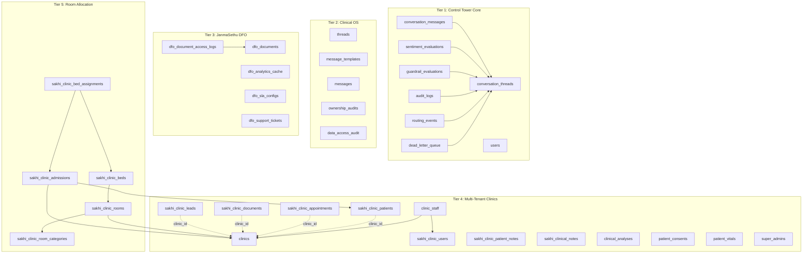

# Patient management — Database Schema Reference

> **Version**: 1.0  
> **Last Updated**: 2026-07-01  
> **Database**: PostgreSQL 15 (via Supabase)  
> **Migration Path**: `control-tower-core/db/`

---

## 1. Schema Overview

The database is organized into **four logical tiers**, applied through 16 sequential SQL migration files:



---

## 2. Tier 1: Control Tower Core (init-db.sql)

### 2.1 `conversation_threads`

The central orchestration table — every conversation in the system.

| Column | Type | Nullable | Default | Description |
|:---|:---|:---|:---|:---|
| `id` | UUID | NO | `uuid_generate_v4()` | Primary key |
| `domain` | TEXT | NO | — | Domain identifier (e.g., `janmasethu`, `oncology`) |
| `user_id` | TEXT | NO | — | External user ID (patient/customer) |
| `channel` | TEXT | NO | — | Source channel: `web`, `mobile`, `api` |
| `status` | TEXT | NO | `'green'` | Thread severity: `green` \| `yellow` \| `red` |
| `ownership` | TEXT | NO | `'AI'` | Current owner: `AI` \| `HUMAN` |
| `assigned_role` | TEXT | YES | — | Target role queue (e.g., `DOCTOR_QUEUE`) |
| `assigned_user_id` | TEXT | YES | — | Specific human assignee ID |
| `is_locked` | BOOLEAN | NO | `FALSE` | Thread lock (TRUE when HUMAN owns) |
| `version` | INTEGER | NO | `1` | Optimistic concurrency version |
| `clinic_id` | UUID | NO | — | Tenant FK → `clinics(id)` *(added in migration 007)* |
| `created_at` | TIMESTAMPTZ | NO | `NOW()` | Creation timestamp |
| `updated_at` | TIMESTAMPTZ | NO | `NOW()` | Last update timestamp |

> **Concurrency Model**: All updates must use `WHERE id = ? AND version = ?` and increment version.

### 2.2 `conversation_messages`

| Column | Type | Nullable | Default | Description |
|:---|:---|:---|:---|:---|
| `id` | UUID | NO | `uuid_generate_v4()` | Primary key |
| `thread_id` | UUID | NO | — | FK → `conversation_threads(id)` CASCADE |
| `sender_id` | TEXT | NO | — | ID of message sender |
| `sender_type` | TEXT | NO | — | `USER` \| `AI` \| `HUMAN` |
| `content` | TEXT | NO | — | Message text (may be encrypted) |
| `created_at` | TIMESTAMPTZ | NO | `NOW()` | Timestamp |

**Index**: `idx_messages_thread_id` on `thread_id`

### 2.3 `sentiment_evaluations`

| Column | Type | Nullable | Default | Description |
|:---|:---|:---|:---|:---|
| `id` | UUID | NO | `uuid_generate_v4()` | Primary key |
| `thread_id` | UUID | NO | — | FK → `conversation_threads(id)` CASCADE |
| `message_id` | UUID | YES | — | Associated message |
| `score` | NUMERIC(5,4) | NO | — | Sentiment score (0.0000 – 1.0000) |
| `label` | TEXT | NO | — | Sentiment label (e.g., `positive`, `negative`) |
| `provider` | TEXT | NO | — | Provider identifier (e.g., `gemini`) |
| `created_at` | TIMESTAMPTZ | NO | `NOW()` | Timestamp |

### 2.4 `guardrail_evaluations`

| Column | Type | Nullable | Default | Description |
|:---|:---|:---|:---|:---|
| `id` | UUID | NO | `uuid_generate_v4()` | Primary key |
| `thread_id` | UUID | NO | — | FK → `conversation_threads(id)` CASCADE |
| `content_snippet` | TEXT | YES | — | First 100 chars of flagged content |
| `triggered_rule` | TEXT | NO | — | Keyword/pattern that triggered |
| `action` | TEXT | NO | — | `escalate` \| `block` \| `warn` |
| `created_at` | TIMESTAMPTZ | NO | `NOW()` | Timestamp |

### 2.5 `audit_logs`

| Column | Type | Nullable | Default | Description |
|:---|:---|:---|:---|:---|
| `id` | UUID | NO | `uuid_generate_v4()` | Primary key |
| `thread_id` | UUID | YES | — | FK → `conversation_threads(id)` SET NULL |
| `actor_id` | TEXT | NO | — | Who performed the action |
| `actor_type` | TEXT | NO | — | `HUMAN` \| `AI` \| `SYSTEM` |
| `action` | TEXT | NO | — | Event type (e.g., `THREAD_INITIALIZED`) |
| `payload` | JSONB | NO | `'{}'` | Structured event metadata |
| `created_at` | TIMESTAMPTZ | NO | `NOW()` | Timestamp |

**Indexes**: `idx_audit_thread_id`, `idx_audit_action`, `idx_audit_logs_thread_event` (compound)

### 2.6 `routing_events`

| Column | Type | Nullable | Default | Description |
|:---|:---|:---|:---|:---|
| `id` | UUID | NO | `uuid_generate_v4()` | Primary key |
| `thread_id` | UUID | NO | — | FK → `conversation_threads(id)` CASCADE |
| `actor_id` | TEXT | NO | — | Who initiated routing |
| `target_role` | TEXT | YES | — | Target role queue |
| `reason` | TEXT | YES | — | Routing reason |
| `created_at` | TIMESTAMPTZ | NO | `NOW()` | Timestamp |

### 2.7 `dead_letter_queue`

| Column | Type | Nullable | Default | Description |
|:---|:---|:---|:---|:---|
| `id` | UUID | NO | `uuid_generate_v4()` | Primary key |
| `thread_id` | UUID | YES | — | FK → `conversation_threads(id)` SET NULL |
| `job_type` | TEXT | NO | — | Type of failed job |
| `payload` | JSONB | NO | `'{}'` | Original job payload |
| `error` | TEXT | YES | — | Error message |
| `attempts` | INTEGER | NO | `0` | Retry count |
| `created_at` | TIMESTAMPTZ | NO | `NOW()` | Timestamp |

### 2.8 `users`

Generic multi-domain user table (Control Tower layer).

| Column | Type | Nullable | Default | Description |
|:---|:---|:---|:---|:---|
| `id` | UUID | NO | `uuid_generate_v4()` | Primary key |
| `email` | TEXT | NO | — | Login email |
| `password_hash` | TEXT | NO | — | Hashed password |
| `full_name` | TEXT | NO | — | Display name |
| `role` | TEXT | NO | — | Domain-specific role |
| `domain` | TEXT | NO | — | Domain identifier |
| `is_active` | BOOLEAN | NO | `TRUE` | Account active flag |
| `created_at` | TIMESTAMPTZ | NO | `NOW()` | Timestamp |
| `updated_at` | TIMESTAMPTZ | NO | `NOW()` | Timestamp |

**Constraint**: `UNIQUE (email, domain)` — same email can exist in different domains.

---

## 3. Tier 2: Clinical OS (02–04)

### 3.1 `threads` (02_clinical_os.sql)

Clinical thread context for patient–clinician interactions.

| Column | Type | Default | Description |
|:---|:---|:---|:---|
| `id` | UUID | `uuid_generate_v4()` | Primary key |
| `patientId` | UUID | — | FK → `patients(id)` |
| `assignedClinicianId` | UUID | — | Assigned clinician |
| `queue` | VARCHAR(50) | `'GENERAL'` | Queue assignment |
| `status` | VARCHAR(50) | `'PENDING'` | Thread status |
| `severity` | VARCHAR(50) | `'GREEN'` | Severity level |
| `ownershipType` | VARCHAR(50) | `'AI'` | AI or HUMAN |
| `clinicalNotes` | TEXT | — | Clinician notes |

### 3.2 `messages` (03_audit_and_messages.sql)

| Column | Type | Description |
|:---|:---|:---|
| `id` | UUID | Primary key |
| `threadId` | UUID | FK → `threads(id)` |
| `senderType` | VARCHAR(20) | `AI` / `PATIENT` / `CLINICIAN` |
| `senderId` | UUID | Sender user ID |
| `content` | TEXT | AES-256 encrypted content |

### 3.3 `ownership_audits` (03_audit_and_messages.sql)

| Column | Type | Description |
|:---|:---|:---|
| `id` | UUID | Primary key |
| `threadId` | UUID | FK → `threads(id)` |
| `fromOwner` | VARCHAR(50) | Previous owner |
| `toOwner` | VARCHAR(50) | New owner |
| `reason` | TEXT | Transition reason |
| `severityScore` | INTEGER | Severity at transition |

### 3.4 `data_access_audit` (04_data_access_audit.sql)

Healthcare compliance tracking for all sensitive data access.

| Column | Type | Description |
|:---|:---|:---|
| `id` | UUID | Primary key |
| `user_id` | VARCHAR(100) | Accessor identity |
| `action` | VARCHAR(50) | `READ` / `CREATE` / `UPDATE` / `DELETE` |
| `resource_type` | VARCHAR(50) | `PATIENT` / `LEAD` / `MESSAGE` / `THREAD` |
| `resource_id` | UUID | Specific record ID |
| `details` | TEXT | Optional metadata |

---

## 4. Tier 3: JanmaSethu DFO (004–006)

### 4.1 `dfo_documents` (004_dfo_documents.sql)

Clinical document registry (prescriptions, reports, discharge summaries).

| Column | Type | Constraint | Description |
|:---|:---|:---|:---|
| `id` | UUID | PK | Primary key |
| `patient_id` | UUID | FK, NOT NULL | → `dfo_patients(id)` CASCADE |
| `consultation_id` | UUID | FK, NULL | → `dfo_consultations(id)` SET NULL |
| `prescription_id` | UUID | FK, NULL | → `dfo_prescriptions(id)` SET NULL |
| `type` | TEXT | CHECK | `prescription` / `report` / `discharge_summary` / `consultation_note` |
| `file_path` | TEXT | NOT NULL | S3 object path |
| `file_name` | TEXT | NOT NULL | Display filename |
| `file_size_bytes` | INTEGER | NULL | File size |
| `mime_type` | TEXT | DEFAULT | DOCX MIME type |
| `version` | INTEGER | DEFAULT 1 | Regeneration version |
| `generated_by` | TEXT | DEFAULT `'SYSTEM'` | Actor who generated |
| `generation_status` | TEXT | CHECK | `pending` / `generated` / `failed` |
| `error_message` | TEXT | NULL | Failure details |

### 4.2 `dfo_document_access_logs`

| Column | Type | Description |
|:---|:---|:---|
| `id` | UUID | Primary key |
| `document_id` | UUID | FK → `dfo_documents(id)` CASCADE |
| `accessed_by` | TEXT | Clinician ID |
| `role` | TEXT | Role at access time |
| `expires_at` | TIMESTAMPTZ | URL expiration |

### 4.3 `dfo_analytics_cache` (005)

| Column | Type | Description |
|:---|:---|:---|
| `key` | TEXT | PK — cache key |
| `value` | JSONB | Cached JSON metrics |
| `updated_at` | TIMESTAMPTZ | Last refresh |
| `expires_at` | TIMESTAMPTZ | TTL expiration |

### 4.4 `dfo_sla_configs` (005)

| Column | Type | Description |
|:---|:---|:---|
| `role` | TEXT | PK — e.g., `NURSE`, `DOCTOR` |
| `max_response_time_seconds` | INTEGER | SLA threshold |

**Seeds**: NURSE=300s (5 min), DOCTOR=1800s (30 min)

### 4.5 `dfo_support_tickets` (006)

| Column | Type | Constraint | Description |
|:---|:---|:---|:---|
| `id` | UUID | PK | Primary key |
| `thread_id` | UUID | FK NULL | → `conversation_threads(id)` |
| `patient_id` | UUID | FK NULL | → `dfo_patients(id)` |
| `patient_phone` | TEXT | — | Contact phone |
| `patient_name` | TEXT | — | Patient display name |
| `category` | TEXT | CHECK | 6 support categories |
| `priority` | TEXT | CHECK | `LOW` / `MEDIUM` / `HIGH` / `CRITICAL` |
| `status` | TEXT | CHECK | `OPEN` / `IN_PROGRESS` / `ESCALATED` / `RESOLVED` / `CLOSED` |
| `source` | TEXT | DEFAULT `'web'` | Channel source |
| `escalation_metadata` | JSONB | DEFAULT `'{}'` | Escalation context |

---

## 5. Tier 4: Multi-Tenant Clinics (007–013)

### 5.1 `clinics` (007)

Master tenant table.

| Column | Type | Description |
|:---|:---|:---|
| `id` | UUID | Primary key |
| `name` | TEXT | Clinic name |
| `address` | TEXT | Physical address |
| `contact_phone` | TEXT | Phone number |
| `contact_email` | TEXT | Email |
| `is_active` | BOOLEAN | Active flag (default TRUE) |

### 5.2 `sakhi_clinic_users`

Clinic staff users (extended in migration 007).

| Column | Type | Description |
|:---|:---|:---|
| `id` | UUID | Primary key |
| `name` | TEXT | Full name |
| `email` | TEXT | Login email (unique per clinic) |
| `password_hash` | TEXT | Hashed password |
| `role` | TEXT | `DOCTOR` / `Receptionist` / `Admin` / etc. |
| `clinic_id` | UUID | FK → `clinics(id)` CASCADE |
| `is_super_admin` | BOOLEAN | Platform-level admin |
| `is_clinic_admin` | BOOLEAN | Clinic-level admin |
| `is_active` | BOOLEAN | Account status |
| `specialization` | TEXT | Doctor specialization *(added migration 012)* |

### 5.3 `sakhi_clinic_patients`

| Key Columns | Description |
|:---|:---|
| `id` | UUID PK |
| `clinic_id` | Tenant FK → `clinics(id)` |
| `uhid` | Unique Hospital ID (auto-generated) |
| `name`, `mobile`, `email` | Contact info |
| `gender`, `dob`, `age`, `blood_group` | Demographics |
| `marital_status`, `aadhar` | Identity |
| `house`, `street`, `area`, `city`, `district`, `state`, `postal_code` | Address |
| `emergency_contact_*` | Emergency contact (3 fields) |
| `assigned_doctor_id` | Doctor assignment |
| `referral_doctor`, `hospital_address` | Referral info |
| `registration_date`, `status` | Registration |
| `lead_id` | FK link to originating lead |
| `pin_hash` | bcrypt-hashed 4-digit PIN *(migration 008)* |
| `failed_attempts` | Login attempt counter *(migration 008)* |
| `locked_until` | Lockout timestamp *(migration 008)* |

### 5.4 `sakhi_clinic_appointments`

| Key Columns | Description |
|:---|:---|
| `id` | UUID PK |
| `clinic_id` | Tenant FK |
| `patient_id`, `lead_id` | Patient or lead reference |
| `doctor_id` | Assigned doctor |
| `appointment_date` | DATE |
| `start_time`, `end_time` | TIME slots (HH:MM format) |
| `type` | `Consultation` / `Follow-up` / `Procedure` / `Emergency` / `Scan` / `Surgery` / `Camp` |
| `status` | `Scheduled` / `Arrived` / `Checked-In` / `Completed` / `Canceled` / `Expected` |
| `visit_reason` | Reason text |
| `*_snapshot` | Denormalized snapshots: patient name, phone, DOB, age, sex, doctor name |
| `source`, `referral_doctor`, `referral_doctor_phone`, `referral_notes` | Referral tracking |
| `cancellation_reason`, `cancelled_at` | Cancellation metadata *(migration 012)* |

### 5.5 `sakhi_clinic_documents`

| Key Columns | Description |
|:---|:---|
| `id` | UUID PK |
| `clinic_id` | Tenant FK |
| `patient_id` | Patient FK (nullable for unassigned) |
| `name` | Document display name |
| `file_path` | S3 object key |
| `file_size`, `mime_type` | File metadata |
| `uploaded_by` | Staff user who uploaded |
| `status` | `unassigned` / `assigned` *(migration 010)* |
| `document_type` | Document categorization |

### 5.6 `sakhi_clinic_leads`

| Key Columns | Description |
|:---|:---|
| `id` | UUID PK |
| `clinic_id` | Tenant FK |
| `name`, `phone` | Lead contact (required) |
| `status` | CRM funnel stage |
| `source`, `inquiry` | Lead source and inquiry type |
| `problem` | AES-encrypted medical concern |
| `treatment_suggested`, `treatment_doctor` | AES-encrypted clinical data |
| `assigned_to_user_id` | CRO/staff assignment |
| `guardian_name`, `guardian_age` | Guardian info |

### 5.7 `clinic_staff` (009_clinic_staff_bridge.sql)

Bridge table for many-to-many user ↔ clinic assignments.

| Column | Type | Constraint | Description |
|:---|:---|:---|:---|
| `id` | UUID | PK | Primary key |
| `user_id` | UUID | FK NOT NULL | → `sakhi_clinic_users(id)` CASCADE |
| `clinic_id` | UUID | FK NOT NULL | → `clinics(id)` CASCADE |
| `role` | TEXT | CHECK | `Doctor` / `CRO` / `Receptionist` / `Nurse` / `Admin` |
| `is_active` | BOOLEAN | DEFAULT TRUE | Active assignment |
| | | UNIQUE | `(user_id, clinic_id)` |

### 5.8 `super_admins`

Decoupled platform super admin table.

| Column | Type | Description |
|:---|:---|:---|
| `id` | UUID | Primary key |
| `name` | TEXT | Admin name |
| `email` | TEXT | Unique email |
| `password_hash` | TEXT | Hashed password |

---

## 6. Tier 5: Room Allocation (014–015)

### 6.1 `sakhi_clinic_room_categories`

| Column | Type | Constraint | Description |
|:---|:---|:---|:---|
| `id` | UUID | PK | Primary key |
| `clinic_id` | UUID | FK NOT NULL | → `clinics(id)` CASCADE |
| `name` | TEXT | NOT NULL | Category name (e.g., "ICU", "General") |
| `description` | TEXT | — | Description |
| `daily_rate` | NUMERIC(10,2) | DEFAULT 0 | Daily billing rate |
| `is_active` | BOOLEAN | DEFAULT TRUE | Active flag |
| | | UNIQUE | `(clinic_id, name)` |

### 6.2 `sakhi_clinic_rooms`

| Column | Type | Constraint | Description |
|:---|:---|:---|:---|
| `id` | UUID | PK | Primary key |
| `clinic_id` | UUID | FK NOT NULL | → `clinics(id)` CASCADE |
| `category_id` | UUID | FK NOT NULL | → `sakhi_clinic_room_categories(id)` RESTRICT |
| `room_number` | TEXT | NOT NULL | Room identifier |
| `floor` | TEXT | — | Floor designation |
| `capacity` | INTEGER | DEFAULT 1 | Max bed count |
| `is_active` | BOOLEAN | DEFAULT TRUE | Active flag |
| | | UNIQUE | `(clinic_id, room_number)` |

### 6.3 `sakhi_clinic_beds`

| Column | Type | Constraint | Description |
|:---|:---|:---|:---|
| `id` | UUID | PK | Primary key |
| `room_id` | UUID | FK NOT NULL | → `sakhi_clinic_rooms(id)` CASCADE |
| `bed_identifier` | TEXT | NOT NULL | Bed label (e.g., "A", "B") |
| `status` | TEXT | CHECK | `available` / `occupied` / `maintenance` / `reserved` |
| `is_active` | BOOLEAN | DEFAULT TRUE | Active flag |
| | | UNIQUE | `(room_id, bed_identifier)` |

### 6.4 `sakhi_clinic_admissions`

| Column | Type | Constraint | Description |
|:---|:---|:---|:---|
| `id` | UUID | PK | Primary key |
| `clinic_id` | UUID | FK NOT NULL | → `clinics(id)` CASCADE |
| `patient_id` | UUID | FK NOT NULL | → `sakhi_clinic_patients(id)` RESTRICT |
| `admitting_doctor_id` | UUID | FK NULL | → `sakhi_clinic_users(id)` SET NULL |
| `admission_date` | TIMESTAMPTZ | DEFAULT NOW() | Admission timestamp |
| `discharge_date` | TIMESTAMPTZ | — | Discharge timestamp |
| `status` | TEXT | CHECK | `admitted` / `discharged` / `cancelled` |
| `diagnosis` | TEXT | — | Admission diagnosis |
| `notes` | TEXT | — | Admission notes |

### 6.5 `sakhi_clinic_bed_assignments`

| Column | Type | Constraint | Description |
|:---|:---|:---|:---|
| `id` | UUID | PK | Primary key |
| `admission_id` | UUID | FK NOT NULL | → `sakhi_clinic_admissions(id)` CASCADE |
| `bed_id` | UUID | FK NOT NULL | → `sakhi_clinic_beds(id)` RESTRICT |
| `daily_rate_snapshot` | NUMERIC(10,2) | NOT NULL | Rate at assignment time |
| `assigned_at` | TIMESTAMPTZ | DEFAULT NOW() | Assignment timestamp |
| `released_at` | TIMESTAMPTZ | — | Release timestamp |
| `is_current` | BOOLEAN | DEFAULT TRUE | Current assignment flag |

**Key Constraints**:
- `UNIQUE INDEX ... WHERE is_current = TRUE` on `bed_id` — prevents double-booking
- `UNIQUE INDEX ... WHERE is_current = TRUE` on `admission_id` — one bed per admission

---

## 7. Stored Procedures (RPC Functions)

### 7.1 `link_new_patient_to_document` (011)

Atomically creates a patient and links them to an unassigned document in a single transaction.

```sql
link_new_patient_to_document(
    p_clinic_id UUID,
    p_document_id UUID,
    p_patient_payload JSONB
) RETURNS JSONB
```

**Transaction Steps**:
1. Verify document exists, belongs to clinic, and is `unassigned`
2. Insert patient dynamically from JSON payload (forces `clinic_id` match)
3. Update document: set `patient_id`, change status to `assigned`

### 7.2 `atomic_create_admission` (015)

Atomically creates an admission with bed assignment to prevent orphaned records.

```sql
atomic_create_admission(
    p_clinic_id UUID,
    p_patient_id UUID,
    p_admitting_doctor_id UUID,
    p_diagnosis TEXT,
    p_notes TEXT,
    p_bed_id UUID,
    p_daily_rate NUMERIC
) RETURNS JSON
```

**Transaction Steps**:
1. Insert admission record
2. Insert bed assignment with rate snapshot
3. Update bed status to `occupied`

---

## 8. Index Strategy

### Compound Indexes for Multi-Tenancy (013)

| Table | Index | Columns |
|:---|:---|:---|
| `sakhi_clinic_patients` | `idx_*_clinic_created_at` | `(clinic_id, created_at DESC)` |
| `sakhi_clinic_appointments` | `idx_*_clinic_created_at` | `(clinic_id, created_at DESC)` |
| `sakhi_clinic_documents` | `idx_*_clinic_created_at` | `(clinic_id, created_at DESC)` |
| `sakhi_clinic_leads` | `idx_*_clinic_created_at` | `(clinic_id, created_at DESC)` |
| *All tenant tables* | `idx_*_clinic_compound` | `(clinic_id, id)` |

### Partial Indexes

| Table | Index | Condition |
|:---|:---|:---|
| `sakhi_clinic_documents` | `idx_sakhi_clinic_docs_unassigned` | `WHERE patient_id IS NULL` |
| `sakhi_clinic_bed_assignments` | `idx_one_active_assignment_per_bed` | `WHERE is_current = TRUE` |
| `sakhi_clinic_bed_assignments` | `idx_one_active_assignment_per_admission` | `WHERE is_current = TRUE` |

---

## 9. Migration History

| # | File | Description |
|:---|:---|:---|
| 00 | `init-db.sql` | Core tables: threads, messages, sentiment, guardrails, audit, routing, DLQ, users |
| 02 | `02_clinical_os.sql` | Clinical threads and message templates |
| 03 | `03_audit_and_messages.sql` | Messages with encryption, ownership audits |
| 04 | `04_data_access_audit.sql` | HIPAA-style data access tracking |
| 004 | `004_dfo_documents.sql` | Document registry and access logs |
| 005 | `005_analytics_hardening.sql` | Analytics cache, performance indexes, SLA configs |
| 006 | `006_support_tickets.sql` | Support ticket system |
| 007 | `007_multi_tenant_foundation.sql` | `clinics` table, `clinic_id` on all tables, compound indexes |
| 008 | `008_patient_portal_auth.sql` | Patient PIN auth fields |
| 009 | `009_clinic_staff_bridge.sql` | Staff ↔ clinic bridge table |
| 010 | `010_clinic_document_status.sql` | Document triage status column |
| 011 | `011_link_new_patient_transaction.sql` | Atomic patient-document linking RPC |
| 012 | `012_add_missing_columns.sql` | User specialization, appointment cancellation fields |
| 013 | `013_compound_indexes.sql` | Time-series compound indexes |
| 014 | `014_room_allocation.sql` | Room categories, rooms, beds, admissions, assignments |
| 015 | `015_room_allocation_edge_cases.sql` | Transfer prevention index, atomic admission RPC |
