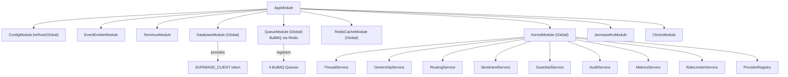
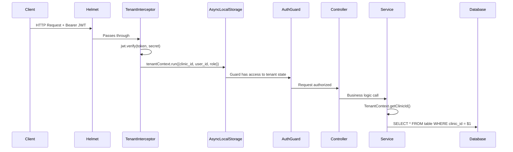
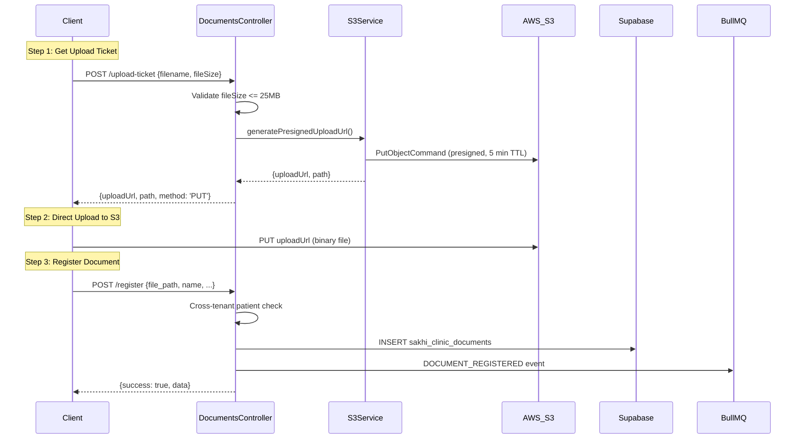
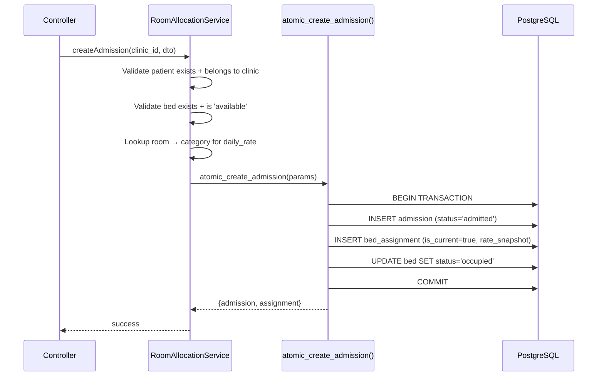

# Patient management — Low-Level Design Document

> **Version**: 1.0  
> **Last Updated**: 2026-07-01  
> **System**: patient management

---

## 1. Module Composition & Dependency Injection

### 1.1 Application Bootstrap (`main.ts`)

```
NestFactory.create(AppModule)
    ├── Helmet (HTTP security headers)
    ├── CORS (origin: "*" — configurable)
    ├── GlobalPipes:
    │   └── ValidationPipe { whitelist: true, transform: true, errorHttpStatusCode: 422 }
    ├── GlobalFilters:
    │   └── HealthcareExceptionFilter
    └── app.listen(PORT || 3001)
```

### 1.2 Module Hierarchy



---

## 2. Kernel Services — Internal Design

### 2.1 ThreadService

**Location**: `src/kernel/thread/thread.service.ts`

```
┌─────────────────────────────────────────────────────┐
│                   ThreadService                      │
│                                                     │
│  Dependencies:                                      │
│    - AuditService                                   │
│    - MessageRepository                              │
│    - ThreadRepository                               │
│    - MetricsService                                 │
│                                                     │
│  Methods:                                           │
│  ┌───────────────────────────────────────────────┐  │
│  │ initializeThread(dto)                         │  │
│  │   1. Create thread (GREEN, AI-owned, v=1)     │  │
│  │   2. Audit: THREAD_INITIALIZED                │  │
│  │   3. Return Thread                            │  │
│  └───────────────────────────────────────────────┘  │
│  ┌───────────────────────────────────────────────┐  │
│  │ validateAIAction(threadId)                    │  │
│  │   1. Get thread                               │  │
│  │   2. IF ownership !== 'AI' OR is_locked:      │  │
│  │      → throw AISuppressionException           │  │
│  │   3. Return thread (safe to proceed)          │  │
│  └───────────────────────────────────────────────┘  │
│  ┌───────────────────────────────────────────────┐  │
│  │ appendMessage(threadId, dto)                  │  │
│  │   1. IF sender_type === 'AI':                 │  │
│  │      → validateAIAction(threadId)             │  │
│  │   2. Create message via repository            │  │
│  │   3. Audit: MESSAGE_APPENDED                  │  │
│  └───────────────────────────────────────────────┘  │
│  ┌───────────────────────────────────────────────┐  │
│  │ updateThreadStatusWithVersionCheck(id, s, v)  │  │
│  │   1. updateAtomic(id, version, {status})      │  │
│  │   2. ON ConcurrencyException:                 │  │
│  │      → metricsService.incrementConflict()     │  │
│  │   3. Audit: STATUS_UPDATED                    │  │
│  └───────────────────────────────────────────────┘  │
└─────────────────────────────────────────────────────┘
```

### 2.2 OwnershipService

**Location**: `src/kernel/ownership/ownership.service.ts`

**State Machine**:
```
           switchOwnership()
    ┌────────────────────────────┐
    │                            │
    ▼                            │
 ┌──────┐  routeToHuman()   ┌──────┐
 │  AI  │ ─────────────────►│HUMAN │
 │      │◄──────────────────│      │
 └──────┘  releaseToAI()    └──────┘
    │                            │
    │     is_locked = false      │     is_locked = true (MANDATORY)
    │                            │
```

**Key Invariant**: When `ownership = HUMAN`, `is_locked` MUST be `true`. This is enforced in `switchOwnership()`.

**Transition Validation**:
- ✅ `AI → HUMAN` (escalation)
- ✅ `HUMAN → AI` (release)
- ❌ `AI → AI` (no-op, passes)
- ❌ `HUMAN → HUMAN` (no-op, passes)
- ❌ All other transitions → `BadRequestException`

### 2.3 GuardrailService

**Location**: `src/kernel/guardrail/guardrail.service.ts`

```
evaluate(threadId, content)
    │
    ├── 1. Fetch thread → get domain
    ├── 2. Load domain config (or 'default')
    ├── 3. Scan content against blockedKeywords[]
    │
    ├── IF keyword found:
    │   ├── 4a. Persist guardrail_evaluations record
    │   ├── 4b. Audit: GUARDRAIL_TRIGGERED
    │   └── 4c. IF config.escalateOnKeyword:
    │       ├── routingService.routeToHuman()
    │       └── Return { status: 'escalate', triggeredRule }
    │
    └── ELSE:
        └── Return { status: 'safe' }
```

### 2.4 RoutingService

**Location**: `src/kernel/routing/routing.service.ts`

```
routeToHuman(threadId, actorId)
    │
    ├── 1. switchOwnership(threadId, HUMAN, actorId, 'SYSTEM')
    ├── 2. Persist routing_events record
    ├── 3. Add job to 'routing_queue' (BullMQ)
    │      { threadId, actorId, reason }
    │      retry: 3 attempts, exponential backoff
    └── 4. Audit: ROUTED_TO_HUMAN
```

---

## 3. Multi-Tenancy Implementation

### 3.1 Tenant Context Pipeline



### 3.2 TenantContext API

**Location**: `src/infrastructure/context/tenant.context.ts`

| Method | Returns | Description |
|:---|:---|:---|
| `TenantContext.getClinicId()` | `string \| undefined` | Current tenant ID |
| `TenantContext.getUserId()` | `string \| undefined` | Current user ID |
| `TenantContext.getRole()` | `string \| undefined` | Current user role |
| `TenantContext.isSuperAdmin()` | `boolean` | Is platform super admin |
| `TenantContext.getState()` | `TenantState` | Full tenant state object |

### 3.3 Cross-Tenant Protection Pattern

Every controller that accesses shared resources implements this guard:

```typescript
// PATTERN: Verify resource ownership before mutation
const { data: resource } = await supabase
    .from('table')
    .select('clinic_id')
    .eq('id', resourceId)
    .single();

if (resource.clinic_id !== TenantContext.getClinicId()) {
    this.logger.warn(`SECURITY: Cross-tenant access attempt`);
    throw new HttpException('Forbidden', HttpStatus.FORBIDDEN);
}
```

---

## 4. Authentication Architecture

### 4.1 Three Authentication Planes

```
┌─────────────────────────────────────────────────────────────┐
│                    AUTHENTICATION PLANES                     │
│                                                             │
│  ┌─────────────────┐  ┌──────────────┐  ┌───────────────┐  │
│  │ Staff Auth      │  │ SuperAdmin   │  │ Patient Auth  │  │
│  │ api/auth/login  │  │ api/v1/super │  │ api/patient-  │  │
│  │                 │  │ admin/auth   │  │ auth/login    │  │
│  │ Table:          │  │              │  │               │  │
│  │ sakhi_clinic_   │  │ Table:       │  │ Table:        │  │
│  │ users           │  │ super_admins │  │ sakhi_clinic_ │  │
│  │                 │  │              │  │ patients      │  │
│  │ Auth: email +   │  │ Auth: email +│  │ Auth: mobile +│  │
│  │ password-hash   │  │ password +   │  │ PIN (bcrypt)  │  │
│  │                 │  │ secret code  │  │               │  │
│  │ JWT TTL: 7d     │  │ JWT TTL: 7d  │  │ JWT TTL: 1h   │  │
│  │                 │  │              │  │               │  │
│  │ Guard:          │  │ Guard:       │  │ Guard:        │  │
│  │ ClinicsAuth     │  │ SuperAdmin   │  │ Manual JWT    │  │
│  │ Guard           │  │ Guard        │  │ verify        │  │
│  └─────────────────┘  └──────────────┘  └───────────────┘  │
└─────────────────────────────────────────────────────────────┘
```

### 4.2 JWT Token Structure

**Staff Token Claims**:
```json
{
    "sub": "uuid",
    "user_id": "uuid",
    "email": "user@clinic.com",
    "role": "Doctor",
    "name": "Dr. Smith",
    "clinic_id": "uuid",
    "is_super_admin": false,
    "is_clinic_admin": true
}
```

**Patient Token Claims**:
```json
{
    "sub": "uuid",
    "patient_id": "uuid",
    "uhid": "UHID-000001",
    "mobile": "+91...",
    "role": "patient",
    "name": "Patient Name"
}
```

### 4.3 Patient PIN Security

```
Login Attempt
    │
    ├── 1. Fetch patient by mobile
    ├── 2. Check lockout (locked_until > now?)
    │      └── YES → 403 "Account locked. Try again in N minutes."
    ├── 3. Check pin_hash exists
    │      └── NO → 401 "No PIN set. Contact clinic."
    ├── 4. bcrypt.compare(pin, pin_hash)
    │
    ├── IF INVALID:
    │   ├── Increment failed_attempts
    │   ├── IF attempts >= 3 → Set locked_until = now + 20 min
    │   └── 401 "Invalid mobile or PIN"
    │
    └── IF VALID:
        ├── Reset failed_attempts = 0, locked_until = null
        └── Issue JWT (1 hour TTL)
```

---

## 5. Event System Design

### 5.1 Event Constants

**Location**: `src/infrastructure/events/event-constants.ts`

| Category | Events |
|:---|:---|
| **Auth** | `AUTH_LOGIN`, `AUTH_LOGIN_FAILED` |
| **Patient** | `PATIENT_CREATED`, `PATIENT_UPDATED`, `PATIENT_PIN_RESET`, `PATIENT_NOTE_CREATED`, `PATIENT_DOCUMENT_UPLOADED` |
| **Lead** | `LEAD_CREATED`, `LEAD_UPDATED`, `LEAD_BULK_IMPORTED` |
| **Appointment** | `APPOINTMENT_CREATED`, `APPOINTMENT_UPDATED`, `APPOINTMENT_CANCELLED` |
| **Document** | `DOCUMENT_REGISTERED`, `DOCUMENT_ASSIGNED`, `DOCUMENT_UNASSIGNED`, `DOCUMENT_DELETED`, `DOCUMENT_ASSIGNED_NEW_PATIENT` |
| **Staff** | `STAFF_ASSIGNED`, `STAFF_UNASSIGNED` |
| **Admission** | `ADMISSION_CREATED`, `ADMISSION_DISCHARGED`, `BED_TRANSFERRED` |

### 5.2 Event Payload Classes

```typescript
abstract class BaseEvent {
    clinic_id: string;
    actor_id: string | null;
    timestamp: string;  // ISO 8601
}

class PatientEvent extends BaseEvent { patient_id: string; details: object; }
class LeadEvent extends BaseEvent { lead_id: string; details: object; }
class DocumentEvent extends BaseEvent { document_id: string; details: object; }
class StaffEvent extends BaseEvent { details: object; }
class AdmissionEvent extends BaseEvent { admission_id: string; details: object; }
class AuthEvent extends BaseEvent { details: object; }
```

### 5.3 BullMQ Queue Configuration

```
All events → dfo_events_queue {
    attempts: 5,
    backoff: {
        type: 'exponential',
        delay: 1000  // 1s, 2s, 4s, 8s, 16s
    }
}
```

---

## 6. Document Management Pipeline

### 6.1 S3 Upload Flow



### 6.2 Document Triage State Machine

```
                register()
    ┌────────────────────────────┐
    │                            │
    ▼                            │
 ┌────────────┐  link()     ┌──────────┐
 │ unassigned │ ───────────►│ assigned │
 │            │◄────────────│          │
 └────────────┘  unlink()   └──────────┘
     │                            │
     │  delete()                  │  delete()
     ▼                            ▼
 ┌────────────────────────────────────┐
 │ DELETED (S3 file + DB record)      │
 └────────────────────────────────────┘
```

---

## 7. Room Allocation & Admission Design

### 7.1 Entity Relationships

```
clinic
  └── room_categories (ICU, General, VIP, ...)
       └── rooms (Room 101, Room 102, ...)
            └── beds (A, B, C, ...)
                 └── bed_assignments
                      └── admissions
                           └── patients
```

### 7.2 Admission Flow



### 7.3 Transfer Flow

```
transferBed(admission_id, new_bed_id)
    │
    ├── 1. Find current assignment WHERE is_current = true
    ├── 2. Release old assignment: is_current = false, released_at = now
    ├── 3. Free old bed: status = 'available'
    ├── 4. Create new assignment: is_current = true
    └── 5. Occupy new bed: status = 'occupied'
```

### 7.4 Discharge Flow

```
dischargeAdmission(admission_id)
    │
    ├── 1. Update admission: status = 'discharged', discharge_date = now
    ├── 2. Release current bed assignment: is_current = false, released_at = now
    └── 3. Free bed: status = 'available'
```

---

## 8. Appointment Scheduling Design

### 8.1 Status FSM

```
┌───────────┐    arrive()    ┌─────────┐    check_in()   ┌───────────┐
│ Scheduled │ ──────────────►│ Arrived │ ───────────────►│ Checked-In│
└───────────┘                └─────────┘                 └───────────┘
      │                                                       │
      │  cancel()                                             │ complete()
      ▼                                                       ▼
┌───────────┐                                           ┌───────────┐
│ Canceled  │                                           │ Completed │
└───────────┘                                           └───────────┘
```

Additional statuses: `Expected`

### 8.2 Double-Booking Prevention

```typescript
// Check for time slot overlap before scheduling
const conflictCheck = await supabase
    .from('sakhi_clinic_appointments')
    .select('id')
    .eq('clinic_id', clinic_id)
    .eq('doctor_id', doctor_id)
    .eq('appointment_date', date)
    .neq('status', 'Canceled')
    .or(`start_time.lte.${end_time},end_time.gte.${start_time}`)
    .limit(1);

if (conflictCheck.data?.length > 0) {
    throw 409 Conflict;
}
```

### 8.3 Snapshot Denormalization

When creating appointments, patient and doctor data is snapshot-copied:

| Snapshot Field | Source |
|:---|:---|
| `patient_name_snapshot` | `patients.name` |
| `patient_phone_snapshot` | `patients.mobile` |
| `patient_dob_snapshot` | `patients.dob` |
| `patient_age_snapshot` | `patients.age` |
| `patient_sex_snapshot` | `patients.gender` |
| `doctor_name_snapshot` | `users.name` |

This ensures appointment display data survives patient/doctor profile updates.

---

## 9. Lead CRM Design

### 9.1 Lead Funnel States

```
New → Follow Up → Consultation Done → Converted Patient
                                    → Stalling - Sent to CRO
                                    → Lost / Inactive / Dropped
```

### 9.2 PII Encryption at Rest

Three lead fields are encrypted with AES-256-CBC via `ClinicsEncryptionService`:

| Field | Encrypted | Algorithm |
|:---|:---|:---|
| `problem` | ✅ | AES-256-CBC |
| `treatment_suggested` | ✅ | AES-256-CBC |
| `treatment_doctor` | ✅ | AES-256-CBC |
| `name`, `phone` | ❌ | Plaintext (searchable) |

### 9.3 Bulk Import Pipeline

```
POST /api/leads/bulk { leads: [...] }
    │
    ├── 1. Normalize all leads (column mapping, status normalization)
    ├── 2. Extract all phones → batch-check existing DB records
    ├── 3. Per-lead validation loop:
    │      ├── Skip if missing name/phone
    │      ├── Skip if phone exists in DB
    │      ├── Skip if phone duplicated in batch
    │      └── Add to valid batch (encrypt PII fields)
    ├── 4. Single INSERT for all valid leads
    ├── 5. Emit LEAD_BULK_IMPORTED event
    └── Return { success: true, count, failed, errors[] }
```

---

## 10. Caching Strategy

### 10.1 Redis Cache Layer

**Location**: `src/infrastructure/cache/redis-cache.service.ts`

| Cache Key | TTL | Invalidation Trigger |
|:---|:---|:---|
| `staff:list:{clinic_id}` | 10 min | `STAFF_ASSIGNED` / `STAFF_UNASSIGNED` event |
| Super admin analytics | 5 min (in-memory) | Manual TTL expiry |
| Analytics cache | Configurable | `dfo_analytics_cache` table |

### 10.2 In-Memory Cache (SuperAdminController)

```typescript
private analyticsCache: {...} | null = null;
private cacheExpiry: number = 0;

// TTL: 5 minutes
if (Date.now() < this.cacheExpiry && this.analyticsCache) {
    return { ...this.analyticsCache, cached: true };
}
// ... fetch fresh data ...
this.cacheExpiry = Date.now() + 5 * 60 * 1000;
```

---

## 11. Error Handling Pattern

### 11.1 Healthcare Exception Filter

All controllers follow a consistent error handling pattern:

```typescript
try {
    // Business logic
    return { success: true, data };
} catch (error: any) {
    // 1. Re-throw known HTTP exceptions (400, 401, 403, 404, 409)
    if (error instanceof HttpException) throw error;
    
    // 2. Log unexpected errors
    this.logger.error(`${method}`, error);
    
    // 3. Return standardized 500 response
    throw new HttpException(
        { success: false, error: error?.message || 'Internal Server Error' },
        HttpStatus.INTERNAL_SERVER_ERROR
    );
}
```

### 11.2 Standard Response Envelope

**Success**: `{ success: true, data: {...}, pagination?: {...} }`  
**Error**: `{ success: false, error: "message", details?: {...} }`

---

## 12. JanmaSethu Domain — Escalation Engine

### 12.1 Risk-Based Routing

| Risk Level | Color | Ownership | Target Queue | SLA |
|:---|:---|:---|:---|:---|
| Green | 🟢 | AI | None | No SLA |
| Yellow | 🟡 | HUMAN | `NURSE_QUEUE` | 10 min (Nurse) |
| Red | 🔴 | HUMAN | `DOCTOR_QUEUE` | 3 min (Nurse first), 5 min (Doctor escalation) |

### 12.2 Permission Matrix

| Role | VIEW_THREAD | ASSIGN_THREAD | TAKE_CONTROL | REPLY | OVERRIDE_SLA | VIEW_PII |
|:---|:---|:---|:---|:---|:---|:---|
| CRO | ✅ | ✅ | ❌ | ❌ | ❌ | ❌ |
| NURSE | ✅ | ❌ | ✅ | ✅ | ❌ | ✅ |
| DOCTOR | ✅ | ✅ | ✅ | ✅ | ✅ | ✅ |

---

## 13. Critical Design Decisions

| Decision | Rationale |
|:---|:---|
| **AsyncLocalStorage for tenant context** | Avoids passing `clinic_id` through every function parameter; thread-safe request scoping |
| **Optimistic concurrency (version field)** | Prevents lost updates without heavyweight pessimistic locks; suitable for moderate write contention |
| **Presigned S3 URLs** | Client uploads directly to S3, reducing backend bandwidth; server never touches file bytes |
| **Supabase as database client** | Unified API for Postgres + real-time subscriptions + storage; simplifies client code vs. raw `pg` |
| **BullMQ for event processing** | Redis-backed persistence, automatic retries, dead-letter queue, dashboard visibility |
| **Denormalized appointment snapshots** | Patient/doctor profile updates don't retroactively change historical appointment records |
| **Atomic Postgres RPCs** | `link_new_patient_to_document` and `atomic_create_admission` prevent orphaned records |
| **Separate `super_admins` table** | Decouples platform admin identity from clinic tenant identity; prevents privilege escalation through JWT claims |
| **Patient PIN vs. password** | Simpler UX for patient portal (4-digit PIN); shorter JWT TTL (1h) compensates for lower entropy |
