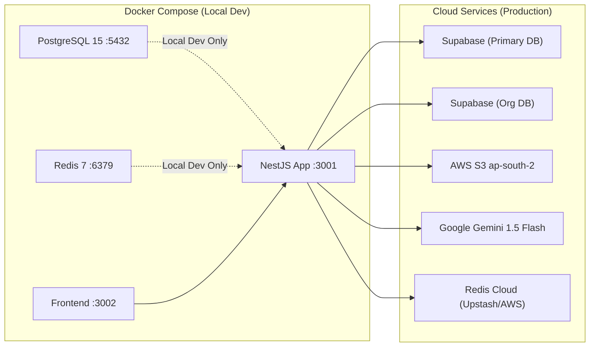

# DFO Backend — System Architecture Overview

> **Version**: 2.0  
> **Last Updated**: 2026-08-18  
> **System**: DFO Control Tower Backend  
> **Framework**: NestJS 11.x (TypeScript 5.7)  
> **Pattern**: Modular Monolith · Event-Driven · Multi-Tenant

---

## 1. Executive Summary

The **DFO Backend** (Digital Front Office) is a **multi-tenant, AI-augmented clinical operating system** built as a **modular monolith** using **NestJS**. It serves as the centralized "Control Tower" for:

- **JanmaSethu** — A maternal healthcare AI platform with real-time triage, AI↔Human handoffs, SLA enforcement, and proactive patient engagement via WhatsApp.
- **Sakhi Clinics** — A multi-tenant clinic management SaaS with patient CRUD, appointments, documents (S3), room allocation, leads CRM, queue management (QMS), analytics dashboards, and a patient portal.

The architecture enforces **defense-in-depth AI suppression**, **optimistic concurrency control**, **field-level PII encryption (AES-256-GCM)**, and **strict multi-tenant isolation** via `AsyncLocalStorage`-backed request-scoped context.

---

## 2. High-Level Architecture

```
┌─────────────────────────────────────────────────────────────────────────┐
│                            CLIENT LAYER                                  │
│  Web Dashboard · Patient Portal · Mobile App · WhatsApp · Swagger API   │
└───────────────────────────────┬──────────────────────────────────────────┘
                                │ HTTPS (JWT Bearer / PIN Auth)
                                ▼
┌─────────────────────────────────────────────────────────────────────────┐
│                    NestJS APPLICATION (Port 3000)                        │
│                                                                          │
│  ┌─── GLOBAL MIDDLEWARE ─────────────────────────────────────────────┐  │
│  │  Helmet · CORS · Trust Proxy · ThrottlerModule (100 req/min)      │  │
│  │  ValidationPipe (whitelist=true, 422) · HealthcareExceptionFilter │  │
│  │  TenantInterceptor (JWT → AsyncLocalStorage)                      │  │
│  └───────────────────────────────────────────────────────────────────┘  │
│                                                                          │
│  ┌─── API LAYER ─────────────────────────────────────────────────────┐  │
│  │  ThreadController · HealthController · DebugController             │  │
│  │  KernelIngressController (POST /ingress/message)                   │  │
│  └─────────────────────────────────┬─────────────────────────────────┘  │
│                                    │                                     │
│  ┌─── KERNEL MODULE (Global) ─────┼─────────────────────────────────┐  │
│  │  ThreadService · OwnershipService · RoutingService                │  │
│  │  SentimentService · GuardrailService · AuditService               │  │
│  │  MetricsService · RateLimiterService · ProviderRegistry           │  │
│  │  Repositories: Thread · Message · Sentiment · Routing · DeadLetter│  │
│  └─────────────────────────────────┬─────────────────────────────────┘  │
│                                    │                                     │
│  ┌─── DOMAIN MODULES ─────────────┼─────────────────────────────────┐  │
│  │                                 │                                  │  │
│  │  ┌─── JanmaSethu Module ────────┤                                 │  │
│  │  │  Handler · Repository (38KB) │ Controllers (5)                 │  │
│  │  │  SLA Worker · Risk Engine    │ Sub-Modules (12):               │  │
│  │  │  Assignment · Takeover       │   Vitals, Alerting, Consent,    │  │
│  │  │  Context · DFO Service       │   ClinicalIntelligence, Auth,   │  │
│  │  │  Leads · Summary · Reporting │   Documents, Engagement(2),     │  │
│  │  │  Audit · RBAC · Encryption   │   Channel/Messaging, Analytics, │  │
│  │  │  Feedback · Notifications    │   SupportEngagement             │  │
│  │  └──────────────────────────────┘                                 │  │
│  │                                                                    │  │
│  │  ┌─── Clinics Module ──────────────────────────────────────────┐  │  │
│  │  │  Controllers (21) · Services (12) · Guards (4)              │  │  │
│  │  │  QMS Engine · Slot Engine · Room Allocation                 │  │  │
│  │  │  Schedules · Analytics · Staff Cache                        │  │  │
│  │  │  Internal Assistant (AI Chat) · QMS WebSocket Gateway       │  │  │
│  │  │  Event Processors: AuditEvent · CacheEvent                  │  │  │
│  │  └────────────────────────────────────────────────────────────┘  │  │
│  └───────────────────────────────────────────────────────────────────┘  │
│                                                                          │
│  ┌─── INFRASTRUCTURE LAYER ──────────────────────────────────────────┐  │
│  │  DatabaseModule (Supabase × 2) · QueueModule (BullMQ)             │  │
│  │  RedisCacheModule (ioredis) · AwsModule (S3)                      │  │
│  │  TenantContext (AsyncLocalStorage) · EncryptionService (AES-256)  │  │
│  │  AISuppressionGuard · EventConstants · EventPayloads              │  │
│  │  InMemoryRedisModule (dev-only)                                   │  │
│  └──────┬──────────────────┬────────────────────┬────────────────────┘  │
└─────────┼──────────────────┼────────────────────┼───────────────────────┘
          │                  │                    │
          ▼                  ▼                    ▼
   ┌────────────┐    ┌────────────┐        ┌────────────┐
   │  Supabase  │    │   Redis    │        │  AWS S3    │
   │ PostgreSQL │    │  BullMQ    │        │  Storage   │
   │  (× 2 DB)  │    │  ioredis   │        │            │
   └────────────┘    └────────────┘        └────────────┘
                                            ┌────────────┐
                                            │  Google    │
                                            │  Gemini AI │
                                            └────────────┘
```

---

## 3. Module Topology

### 3.1 Root Module (`AppModule`)

The root orchestrator registers all global infrastructure and domain modules:

| Import | Scope | Purpose |
|:---|:---|:---|
| `ConfigModule.forRoot()` | Global | Environment variables from `.env` with custom `configuration.ts` factory |
| `EventEmitterModule.forRoot()` | Global | NestJS in-process event bus (queue updates, audit events) |
| `TerminusModule` | Global | Health check endpoints for load balancers |
| `ThrottlerModule` | Global | Rate limiting: 100 requests per 60 seconds |
| `DatabaseModule` | Global | Supabase client injection (`SUPABASE_CLIENT`, `ORG_SUPABASE_CLIENT`) |
| `QueueModule` | Global | BullMQ root config + 3 named queues (`routing`, `engagement`, `reminder`) |
| `RedisCacheModule` | Global | ioredis client + `RedisCacheService` |
| `KernelModule` | Global | Domain-agnostic orchestration engine |
| `JanmasethuModule` | Scoped | Maternal healthcare domain |
| `ClinicsModule` | Scoped | Multi-tenant clinic management domain |
| `InMemoryRedisModule` | Dev only | In-memory Redis mock for local development (skipped in production) |

**Global Providers:**
- `TenantInterceptor` — Registered as `APP_INTERCEPTOR`, extracts JWT claims into `AsyncLocalStorage` on every request.

**Root Controllers:**
- `ThreadController` (`/thread`) — Core thread CRUD
- `HealthController` (`/health`) — Kubernetes probes
- `DebugController` (`/debug`) — Development diagnostics

---

### 3.2 Module Dependency Graph

```mermaid
graph TD
    App["AppModule"] --> Config["ConfigModule (Global)"]
    App --> EventEmitter["EventEmitterModule"]
    App --> Terminus["TerminusModule"]
    App --> Throttler["ThrottlerModule"]
    App --> DB["DatabaseModule (Global)"]
    App --> Queue["QueueModule (Global)"]
    App --> Cache["RedisCacheModule (Global)"]
    App --> Kernel["KernelModule (Global)"]
    App --> Janmasethu["JanmasethuModule"]
    App --> Clinics["ClinicsModule"]
    App --> InMemoryRedis["InMemoryRedisModule (Dev)"]

    Kernel --> AuditMod["AuditModule"]
    Kernel --> GuardrailMod["GuardrailModule"]
    Kernel --> MetricsMod["MetricsModule"]
    Kernel --> ThreadRepo["ThreadRepository"]
    Kernel --> MessageRepo["MessageRepository"]
    Kernel --> SentimentRepo["SentimentRepository"]
    Kernel --> RoutingRepo["RoutingRepository"]
    Kernel --> DeadLetterRepo["DeadLetterRepository"]

    Clinics --> AwsMod["AwsModule (S3)"]
    Clinics --> BullQ1["BullMQ: dfo_events_queue"]

    Janmasethu --> BullQ2["BullMQ: janmasethu_sla_queue"]
    Janmasethu --> BullQ3["BullMQ: appointment_checker"]
    Janmasethu --> BullQ4["BullMQ: document_generation_queue"]
    Janmasethu --> BullQ5["BullMQ: janmasethu_analytics_queue"]
    Janmasethu --> EngagementModule
    Janmasethu --> AuditMod
    Janmasethu --> MessagingModule
    Janmasethu --> DocumentModule
    Janmasethu --> AnalyticsModule
    Janmasethu --> VitalsModule
    Janmasethu --> ClinicalIntelModule["ClinicalIntelligenceModule"]
    Janmasethu --> AlertingModule
    Janmasethu --> AuthModule
    Janmasethu --> ConsentModule
    Janmasethu --> SupportEngModule["SupportEngagementModule"]

    DB --> Supabase["Supabase Client"]
    DB --> OrgSupabase["Org Supabase Client"]
    Queue --> Redis["Redis / BullMQ"]
    Cache --> Redis
```



---

## 4. Layered Architecture

The codebase follows a strict 4-layer separation:

```
┌─────────────────────────────────────────────────┐
│  Layer 1: API (Controllers, Guards, DTOs)        │  ← HTTP interface
├─────────────────────────────────────────────────┤
│  Layer 2: Domain (Services, Handlers, Policies)  │  ← Business rules
├─────────────────────────────────────────────────┤
│  Layer 3: Kernel (Orchestration, Contracts)       │  ← Domain-agnostic core
├─────────────────────────────────────────────────┤
│  Layer 4: Infrastructure (DB, Cache, Queue, S3)   │  ← External systems
└─────────────────────────────────────────────────┘
```

### Layer Responsibilities

| Layer | Directory | Responsibility |
|:---|:---|:---|
| **API** | `src/api/`, `src/domains/*/controllers/` | Route definitions, request validation, guard application, response shaping |
| **Domain** | `src/domains/janmasethu/`, `src/domains/clinics/services/` | Business logic, state machines, policy enforcement, domain events |
| **Kernel** | `src/kernel/` | Thread lifecycle, ownership transitions, sentiment evaluation, guardrails, audit, metrics, routing — all domain-agnostic |
| **Infrastructure** | `src/infrastructure/` | Database access (Supabase), Redis caching, BullMQ queues, AWS S3, encryption, tenant context, exception filters |

### Cross-Cutting Concerns

| Concern | Implementation |
|:---|:---|
| **Multi-Tenancy** | `TenantInterceptor` → `AsyncLocalStorage` → `TenantContext` static accessors |
| **Authentication** | `ClinicsAuthGuard` (JWT), `SuperAdminGuard`, `JwtAuthGuard`, `PatientAuth` (PIN-based) |
| **Authorization** | `@Roles()` decorator + `RolesGuard`, `@Permissions()` + `PermissionsGuard`, `JanmasethuRbacService` |
| **AI Safety** | `AISuppressionGuard` (HTTP) + `ThreadService.validateAIAction()` (service) + `JanmasethuScopePolicy.shouldSuppressAI()` (domain) |
| **Audit Trail** | `AuditService.append()` on every state transition, `AuditEventProcessor` via BullMQ |
| **PII Protection** | `EncryptionService` (AES-256-GCM), `JanmasethuEncryptionService`, `ClinicsEncryptionService` |
| **Error Handling** | `HealthcareExceptionFilter` — standardized `{ success, error, code, timestamp, path }` |

---

## 5. Deployment Architecture



### Runtime Services

| Service | Protocol | Configuration | Purpose |
|:---|:---|:---|:---|
| **Supabase (Primary)** | HTTPS REST | `SUPABASE_URL` + `SUPABASE_SERVICE_ROLE_KEY` | Primary PostgreSQL database |
| **Supabase (Org)** | HTTPS REST | `ORG_SUPABASE_URL` + `ORG_SUPABASE_SERVICE_ROLE_KEY` | Organization-level database (fallback to primary) |
| **Redis** | TCP | `REDIS_HOST:REDIS_PORT` + optional `REDIS_PASSWORD` + `REDIS_TLS` | BullMQ job queues + ioredis caching |
| **AWS S3** | HTTPS | `AWS_REGION` + `AWS_ACCESS_KEY_ID` + `AWS_SECRET_ACCESS_KEY` + `AWS_S3_BUCKET_NAME` | Clinical document storage with presigned URLs |
| **Google Gemini** | HTTPS | `GEMINI_API_KEY` | AI-powered clinical intelligence (conversation analysis) |

### Build & Runtime

| Aspect | Technology |
|:---|:---|
| **Language** | TypeScript 5.7 |
| **Runtime** | Node.js |
| **Framework** | NestJS 11.x |
| **Build** | SWC compiler via `@swc/core` |
| **Container** | Docker (multi-stage Dockerfile) |
| **Orchestration** | Docker Compose (local) |
| **Testing** | Jest 30 + TestContainers (PostgreSQL + Redis) |
| **Linting** | ESLint 9 + Prettier |
| **API Docs** | Swagger/OpenAPI at `/api` |

---

## 6. BullMQ Queue Architecture

The system uses **8 named BullMQ queues** across modules:

| Queue Name | Registered In | Purpose | Consumer |
|:---|:---|:---|:---|
| `routing_queue` | `QueueModule` (Global) | Human agent assignment routing | `RoutingService` |
| `engagement_queue` | `QueueModule` (Global) | Proactive patient engagement dispatch | `EngagementEngineService` |
| `reminder_queue` | `QueueModule` (Global) | Appointment reminders | Reminder processor |
| `dfo_events_queue` | `ClinicsModule` | Audit log + cache invalidation events | `AuditEventProcessor`, `CacheEventProcessor` |
| `janmasethu_sla_queue` | `JanmasethuModule` | SLA breach detection & escalation | `JanmasethuSlaWorker` |
| `appointment_checker` | `JanmasethuModule` | No-show periodic scanner (hourly cron) | `AppointmentNoShowWorker` |
| `document_generation_queue` | `JanmasethuModule` | Async DOCX/PDF clinical document generation | `DocumentWorker` |
| `janmasethu_analytics_queue` | `JanmasethuModule` | Analytics aggregation jobs | `AnalyticsWorker` |

All queues use **exponential backoff retry** (attempts: 3-5, base delay: 1000ms).

---

## 7. Configuration Architecture

Configuration flows from environment variables through a typed factory:

```
.env → ConfigModule.forRoot() → configuration.ts → ConfigService.get('app.*')
```

### Configuration Namespace Tree

```
app
├── supabase
│   ├── url             (SUPABASE_URL)
│   └── key             (SUPABASE_SERVICE_ROLE_KEY | SUPABASE_KEY | SUPABASE_ANOYN_KEY)
├── orgSupabase
│   ├── url             (ORG_SUPABASE_URL)
│   └── key             (ORG_SUPABASE_SERVICE_ROLE_KEY)
├── redis
│   ├── host            (REDIS_HOST, default: localhost)
│   ├── port            (REDIS_PORT, default: 6379)
│   ├── password        (REDIS_PASSWORD)
│   └── tls             (REDIS_TLS)
├── domains
│   ├── default
│   │   ├── sentimentThresholds { red: 0.3, yellow: 0.6 }
│   │   ├── guardrailPolicy { blockedKeywords, escalateOnKeyword }
│   │   └── escalationMatrix { defaultRole, criticalRole }
│   └── e-commerce (example extensibility)
└── hardening
    ├── escalationSlaTimeout    (default: 300000ms = 5 min)
    ├── workerRetryAttempts     (default: 3)
    └── routingStaleTimeout     (default: 600000ms = 10 min)
```

### Additional Environment Variables

| Variable | Purpose |
|:---|:---|
| `JWT_SECRET` | Staff/admin JWT signing key |
| `ENCRYPTION_KEY` | AES-256 key (hex-encoded) for PII encryption |
| `AWS_REGION`, `AWS_ACCESS_KEY_ID`, `AWS_SECRET_ACCESS_KEY`, `AWS_S3_BUCKET_NAME` | S3 document storage |
| `GEMINI_API_KEY` | Google Gemini AI for clinical intelligence |
| `AI_PROVIDER` | Override AI provider: `GEMINI`, `CUSTOM`, or `MOCK` |
| `SUPER_ADMIN_SECRET_CODE` | Secret for super admin signup |

---

## 8. Source Code Statistics

| Component | Files | Total Size | Notable |
|:---|:---|:---|:---|
| **Kernel Module** | ~15 files | ~25 KB | Domain-agnostic orchestration core |
| **JanmaSethu Module** | ~60 files | ~250 KB | Largest domain; `janmasethu.repository.ts` alone is 38 KB |
| **Clinics Module** | ~40 files | ~300 KB | `patients.controller.ts` is 56 KB, `appointments.controller.ts` is 38 KB |
| **Infrastructure** | ~20 files | ~30 KB | Shared database, cache, queue, security |
| **Database Migrations** | 37 SQL files | ~75 KB | Sequential migration from `init-db.sql` through `030_*` |
| **Test Scripts** | ~15 files | ~50 KB | Integration test scripts for tenant isolation |

---

## 9. Key Architectural Decisions

| Decision | Rationale |
|:---|:---|
| **Modular Monolith over Microservices** | Reduces operational overhead while maintaining domain isolation via NestJS modules. Single deployment artifact. |
| **Supabase over direct PostgreSQL** | Provides Auth, Realtime, and REST API out-of-box. Service role key for backend access bypasses RLS. |
| **Two Supabase Clients** | `SUPABASE_CLIENT` for primary clinical data; `ORG_SUPABASE_CLIENT` for organization-level data (with fallback). |
| **BullMQ over alternatives** | Mature Redis-backed job queue with built-in retry, backoff, scheduling, and dead-letter support. |
| **AsyncLocalStorage for Tenancy** | Zero-overhead, request-scoped tenant context without passing `clinic_id` through every function parameter. |
| **AES-256-GCM for PII** | Authenticated encryption prevents both eavesdropping and tampering of sensitive patient data. |
| **SWC over tsc for builds** | 10-20x faster compilation with identical output. |
| **Swagger at `/api`** | Auto-generated API documentation from controller decorators. |
