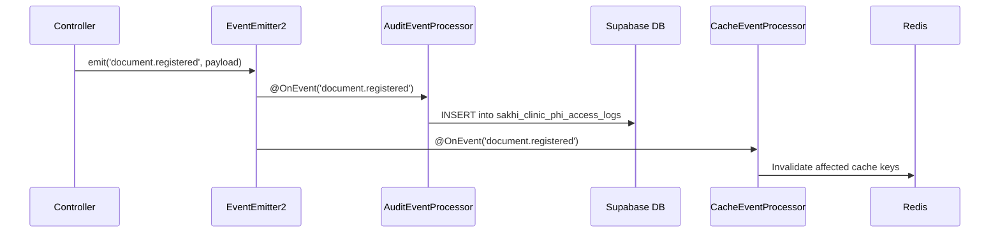

# DFO Backend — Security Architecture

> **Version**: 2.0  
> **Last Updated**: 2026-08-18  
> **System**: DFO Control Tower Backend  
> **Classification**: Internal Engineering Reference

---

## 1. Security Philosophy

The DFO Backend implements **defense-in-depth security** — multiple independent security layers ensure that a single failure cannot compromise the system. The architecture is designed for **healthcare-grade compliance** (HIPAA-style controls) with:

- **Zero-trust request pipeline** — Every request is authenticated, validated, and tenant-scoped
- **Layered AI suppression** — Three independent layers prevent AI from operating when human oversight is required
- **Encryption at rest** — AES-256-GCM for PII fields; bcrypt for passwords/PINs
- **Complete audit trail** — Every state transition, data access, and authentication event is logged immutably

---

## 2. Request Security Pipeline

Every HTTP request flows through this pipeline in strict order:

```
Request → Helmet → CORS → Trust Proxy → ThrottlerModule
                                            │
                                            ▼
                                     ValidationPipe
                                   (whitelist: true,
                                    forbidNonWhitelisted: true,
                                    errorHttpStatusCode: 422)
                                            │
                                            ▼
                                    TenantInterceptor
                                  (JWT → AsyncLocalStorage)
                                            │
                                            ▼
                              ┌─── Auth Guards (per-route) ───┐
                              │                                │
                              │  ClinicsAuthGuard              │
                              │  SuperAdminGuard               │
                              │  RolesGuard (@Roles)           │
                              │  PermissionsGuard              │
                              │  JwtAuthGuard (JanmaSethu)     │
                              │  AISuppressionGuard            │
                              │                                │
                              └────────────┬───────────────────┘
                                           │
                                           ▼
                                     Controller Logic
                                           │
                                           ▼
                                HealthcareExceptionFilter
                              (Standardized error response)
```

### 2.1 Helmet (HTTP Hardening)

Applied globally in `main.ts`. Sets security headers:
- `X-Content-Type-Options: nosniff`
- `X-Frame-Options: DENY`
- `X-XSS-Protection: 1; mode=block`
- `Strict-Transport-Security` (HSTS)
- Content-Security-Policy restrictions

### 2.2 CORS

`app.enableCors()` — Currently permissive (all origins). Should be restricted per environment in production.

### 2.3 Rate Limiting

```typescript
ThrottlerModule.forRoot([{
    ttl: 60000,     // 60 seconds window
    limit: 100,     // Max 100 requests per window per IP
}])
```

`Trust Proxy` is enabled (`app.set('trust proxy', 1)`) to correctly identify client IPs behind load balancers.

### 2.4 Input Validation

The global `ValidationPipe` enforces:

| Property | Value | Effect |
|:---|:---|:---|
| `whitelist` | `true` | Strips unknown properties from request bodies |
| `forbidNonWhitelisted` | `true` | Throws 422 if unknown properties are present |
| `transform` | `true` | Auto-transforms payloads to DTO class instances |
| `errorHttpStatusCode` | `422` | Returns Unprocessable Entity on validation failures |

---

## 3. Authentication Architecture

### 3.1 Authentication Flows

```mermaid
graph TD
    subgraph "Staff Login"
        S1["POST /api/auth/login"] --> S2["Email + Password Hash"]
        S2 --> S3["Verify against sakhi_clinic_users"]
        S3 --> S4["Sign JWT (7-day TTL)"]
        S4 --> S5["JWT contains: sub, email, role, clinic_id, is_super_admin"]
    end

    subgraph "Super Admin Login"
        SA1["POST /api/v1/superadmin/auth/login"] --> SA2["Email + Password"]
        SA2 --> SA3["Verify + Check is_super_admin"]
        SA3 --> SA4["Sign JWT (7-day TTL)"]
    end

    subgraph "Super Admin Signup"
        SAS1["POST /api/v1/superadmin/auth/signup"] --> SAS2["Email + Password + Secret Code"]
        SAS2 --> SAS3["Validate SUPER_ADMIN_SECRET_CODE"]
        SAS3 --> SAS4["Create User + Sign JWT"]
    end

    subgraph "Patient Portal Login"
        P1["POST /api/patient-auth/login"] --> P2["Mobile Number + 4-digit PIN"]
        P2 --> P3["Verify PIN via bcrypt"]
        P3 --> P4["Lockout check (max 5 failed attempts)"]
        P4 --> P5["Sign JWT (1-hour TTL)"]
        P5 --> P6["JWT contains: sub=patient_id, clinic_id, role=patient"]
    end
```



### 3.2 JWT Structure

**Staff/Admin JWT Claims:**
```json
{
  "sub": "user-uuid",
  "email": "doctor@clinic.com",
  "name": "Dr. Name",
  "user_role": "doctor",
  "role": "doctor",
  "clinic_id": "clinic-uuid",
  "is_super_admin": false,
  "is_clinic_admin": true,
  "iat": 1723968000,
  "exp": 1724572800
}
```

**Patient JWT Claims:**
```json
{
  "sub": "patient-uuid",
  "clinic_id": "clinic-uuid",
  "role": "patient",
  "iat": 1723968000,
  "exp": 1723971600
}
```

### 3.3 Token Lifecycle Security

| Feature | Implementation |
|:---|:---|
| **Zombie Token Prevention** | `ClinicsAuthGuard` queries `sakhi_clinic_users.is_active` on every request. Disabled users' tokens are immediately rejected. |
| **Token TTL Differentiation** | Staff: 7 days (convenience). Patients: 1 hour (security — PIN-based auth is weaker). |
| **Super Admin Bypass** | If `is_super_admin` is true in JWT, the active-user DB check is skipped (super admins exist at platform level). |
| **Patient Lockout** | 5 failed PIN attempts trigger account lockout. Requires admin PIN reset. |
| **Graceful DB Failure** | If Supabase is unreachable during token verification, returns `503 Service Unavailable` instead of `401` to avoid false lockouts. |

---

## 4. Multi-Tenant Isolation

### 4.1 Tenant Context Propagation

```
JWT → TenantInterceptor → AsyncLocalStorage → TenantContext (Static Getters)
```

**Flow:**

1. `TenantInterceptor` runs on every request as `APP_INTERCEPTOR`
2. Extracts `user_id`, `clinic_id`, `role`, `is_super_admin`, `is_clinic_admin`, `raw_token` from JWT payload
3. Stores in `AsyncLocalStorage` via `tenantContext.run(state, callback)`
4. Any service can call `TenantContext.getClinicId()`, `TenantContext.getUserId()`, `TenantContext.getRole()`, `TenantContext.isSuperAdmin()` without parameter passing

### 4.2 Data Isolation Guarantees

| Layer | Mechanism |
|:---|:---|
| **Query Scoping** | Every Supabase query includes `.eq('clinic_id', TenantContext.getClinicId())` |
| **Cross-Tenant Guards** | Controllers explicitly verify `record.clinic_id === TenantContext.getClinicId()` before returning data |
| **Compound Indexes** | Database has compound indexes on `(clinic_id, id)` for all tenant-scoped tables |
| **JWT Binding** | `clinic_id` is embedded in the JWT at sign time — cannot be spoofed without the signing key |
| **Super Admin Override** | Only `is_super_admin` accounts can query across tenants. Regular users cannot override their `clinic_id`. |

### 4.3 TenantState Interface

```typescript
export interface TenantState {
  user_id?: string;
  clinic_id?: string;
  role?: string;
  is_super_admin?: boolean;
  is_clinic_admin?: boolean;
  raw_token?: string;
}
```

---

## 5. AI Suppression — Defense in Depth

AI must NEVER respond when human oversight is required. The system enforces this at **three independent layers**:

```
┌─────────────────────────────────────────────────────────┐
│                  AI SUPPRESSION LAYERS                    │
│                                                          │
│  Layer 1: HTTP Guard (AISuppressionGuard)                │
│  ├── Checks thread_id from request body/params          │
│  ├── Fetches thread from ThreadService                  │
│  ├── BLOCKS if: status=YELLOW|RED, ownership=HUMAN,     │
│  │             is_locked=true, ai_suppressed=true       │
│  └── Throws: 403 ForbiddenException                     │
│                                                          │
│  Layer 2: Service Validation (ThreadService)             │
│  ├── validateAIAction(threadId)                         │
│  ├── Called before every AI message append               │
│  ├── BLOCKS if: ownership≠AI, is_locked, ai_suppressed  │
│  └── Throws: AISuppressionException                      │
│                                                          │
│  Layer 3: Domain Policy (JanmasethuScopePolicy)          │
│  ├── shouldSuppressAI(thread)                           │
│  ├── Called in JanmasethuHandler before processing       │
│  ├── BLOCKS if: status=YELLOW|RED, ownership=HUMAN,     │
│  │             is_locked=true                           │
│  └── Returns: boolean (silently drops message)          │
│                                                          │
│  Layer 4: Handler Guardrail (JanmasethuGuardrailService) │
│  ├── isAIPermitted(status, lastSenderType, isLocked)    │
│  ├── Returns: { permitted: boolean, reason: string }     │
│  └── Prevents AI from responding to already-escalated   │
│      threads                                            │
└─────────────────────────────────────────────────────────┘
```

### Suppression Triggers

| Condition | Layer 1 | Layer 2 | Layer 3 | Layer 4 |
|:---|:---:|:---:|:---:|:---:|
| Thread status = YELLOW/RED | ✅ | — | ✅ | ✅ |
| Thread ownership = HUMAN | ✅ | ✅ | ✅ | — |
| Thread is_locked = true | ✅ | ✅ | ✅ | ✅ |
| Thread ai_suppressed = true | ✅ | ✅ | — | — |

---

## 6. Encryption Architecture

### 6.1 PII Encryption at Rest (AES-256-GCM)

**Service:** `EncryptionService` (`src/infrastructure/security/encryption.service.ts`)

```
Plaintext → AES-256-GCM (random IV) → iv:authTag:ciphertext (hex-encoded)
```

| Parameter | Value |
|:---|:---|
| **Algorithm** | AES-256-GCM (authenticated encryption) |
| **IV Length** | 16 bytes (randomly generated per encryption) |
| **Auth Tag** | 16 bytes (integrity verification) |
| **Key** | 32 bytes from `ENCRYPTION_KEY` env var (hex-encoded) |
| **Output Format** | `{iv_hex}:{tag_hex}:{ciphertext_hex}` |

**Graceful Decryption:** If decryption fails (e.g., unencrypted legacy data), the original text is returned instead of throwing.

### 6.2 Domain-Specific Encryption Services

| Service | Domain | Fields Encrypted |
|:---|:---|:---|
| `ClinicsEncryptionService` | Clinics | Patient names, contact details, medical notes |
| `JanmasethuEncryptionService` | JanmaSethu | Phone numbers, patient profiles, consultation data |
| `PiiDecrypterService` | JanmaSethu | Bulk decryption for list views |
| `ChatDecrypterService` | JanmaSethu | Message content decryption for chat views |

### 6.3 Password/PIN Hashing

| Actor | Algorithm | Details |
|:---|:---|:---|
| Staff passwords | `password-hash` library | SHA-based hash with salt |
| Patient PINs | `bcrypt` (v5.1) | 10 salt rounds, 4-digit PIN |

---

## 7. Authorization (RBAC)

### 7.1 Clinics Module Roles

| Role | Capabilities |
|:---|:---|
| `admin` / `clinic_admin` | Full clinic management, user CRUD, analytics, room allocation |
| `doctor` | Patient management, appointments, clinical notes, documents |
| `nurse` | Patient vitals, appointment check-in, document triage |
| `receptionist` | Appointments, QMS, patient registration |
| `cro` | Lead management, dashboard analytics, patient funnels |
| `patient` | Portal access, own appointments/documents, PIN-based auth |
| `super_admin` | Platform-wide: clinic CRUD, cross-tenant analytics, user management |

### 7.2 JanmaSethu Roles & Permissions

```typescript
enum JanmasethuPermission {
    VIEW_THREAD    // See thread details
    ASSIGN_THREAD  // Assign to clinician
    TAKE_CONTROL   // Take ownership (AI→HUMAN)
    REPLY          // Send messages in thread
    OVERRIDE_SLA   // Override SLA timers
    VIEW_PII       // Access decrypted patient data
}
```

**Visibility Matrix:**

| Role | Green Threads | Yellow Threads | Red Threads |
|:---|:---:|:---:|:---:|
| CRO | ✅ | ✅ | ✅ |
| NURSE | ❌ | ✅ | ✅ |
| DOCTOR | ❌ | ❌ | ✅ |

### 7.3 Guard Stack

| Guard | Applied To | Logic |
|:---|:---|:---|
| `ClinicsAuthGuard` | All clinic endpoints | JWT verification + active user check |
| `SuperAdminGuard` | `/api/v1/superadmin/*` | Checks `is_super_admin` JWT claim |
| `RolesGuard` | Endpoints with `@Roles()` | Validates user role against allowed list |
| `PermissionsGuard` | Endpoints with `@Permissions()` | Fine-grained permission check |
| `AISuppressionGuard` | Thread message endpoints | Prevents AI actions on escalated threads |

---

## 8. Audit Trail Architecture

### 8.1 Audit Log Types

| System | Table | Scope |
|:---|:---|:---|
| **Kernel Audit** | `audit_logs` | Thread lifecycle: init, status change, ownership switch, message append, SLA breach |
| **Clinics Data Audit** | `sakhi_clinic_phi_access_logs` | PHI access: who viewed/modified patient data, when, from which IP |
| **QMS Audit** | `qms_audit_logs` | Queue status transitions: BOOKED→WAITING→CALLED→COMPLETED |
| **JanmaSethu Audit** | `audit_logs` + domain-specific | PII access logging, clinical update auditing, risk score tracking |
| **Consent Audit** | Via `AuditService` | Consent preference changes, emergency consent overrides |

### 8.2 Event-Driven Audit Processing



### 8.3 Event Constants

The system defines **32 strongly-typed event constants** across 6 categories:

| Category | Events |
|:---|:---|
| **Documents** | `registered`, `assigned`, `unassigned`, `deleted`, `assignedWithNewPatient` |
| **Patients** | `created`, `updated`, `document.uploaded`, `note.created/updated/deleted`, `treatment.created/updated/deleted`, `pin.reset` |
| **Appointments** | `created`, `updated`, `statusChanged` |
| **Room Allocation** | `admission.created/discharged/cancelled/transferred`, `bed.transferred` |
| **Leads** | `created`, `bulkImported`, `updated`, `reEngaged` |
| **Auth** | `login`, `loginFailed`, `passwordChanged`, `profileUpdated` |

---

## 9. S3 Document Security

### 9.1 Upload Flow (Presigned URLs)

```
1. Client → POST /api/v1/clinics/documents/upload-ticket
2. Server validates auth + generates presigned PUT URL (5-min TTL)
3. Server returns { uploadUrl, path }
4. Client → PUT directly to S3 (server never handles file bytes)
5. Client → POST /api/v1/clinics/documents/register (registers metadata in DB)
```

### 9.2 Download Flow

```
1. Client → GET /api/v1/clinics/documents/:id/download
2. Server verifies: auth + tenant isolation (doc.clinic_id === user.clinic_id)
3. Server generates presigned GET URL (1-hour TTL)
4. Returns URL to client for direct S3 download
```

### 9.3 Path Sanitization

```typescript
// Prevents path traversal attacks
const baseFilename = basename(filename);
const safeFilename = baseFilename.replace(/[^a-zA-Z0-9.\-_]/g, '_');
const safeDocumentType = documentType.replace(/[^a-zA-Z0-9_-]/g, '').toLowerCase();

// S3 Key Structure
const path = `clinics/${clinicId}/${safeDocumentType}/${Date.now()}-${safeFilename}`;
```

---

## 10. Error Handling

### 10.1 HealthcareExceptionFilter

All unhandled exceptions are caught and normalized:

```json
{
  "success": false,
  "error": "Human-readable error message",
  "code": "INTERNAL_ERROR",
  "timestamp": "2026-08-18T10:00:00.000Z",
  "path": "/api/v1/clinics/patients"
}
```

### 10.2 Custom Exceptions

| Exception | HTTP Status | When |
|:---|:---|:---|
| `AISuppressionException` | 403 | AI attempts action on locked/escalated thread |
| `ConcurrencyException` | 409 | Optimistic lock version mismatch |
| `InvalidTransitionError` | 400 | Illegal state transition (e.g., RED→YELLOW) |
| `UnauthorizedException` | 401 | Invalid/expired JWT, disabled user |
| `ServiceUnavailableException` | 503 | Database unreachable during auth |
