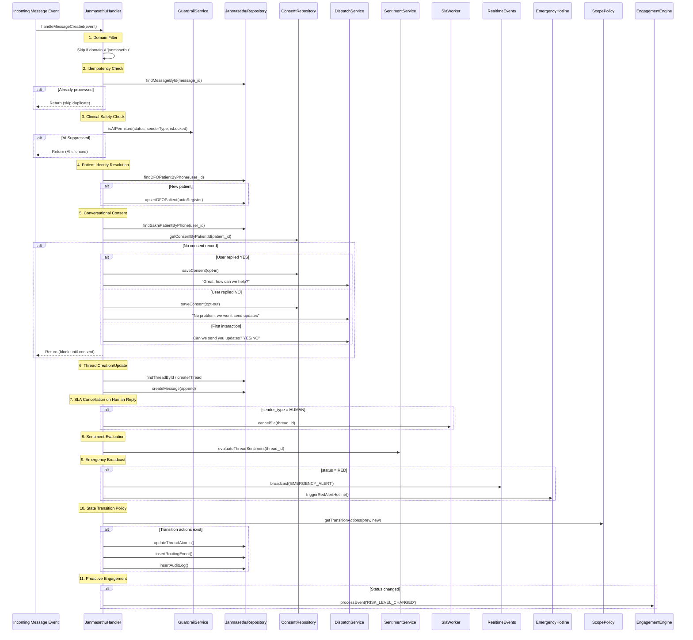
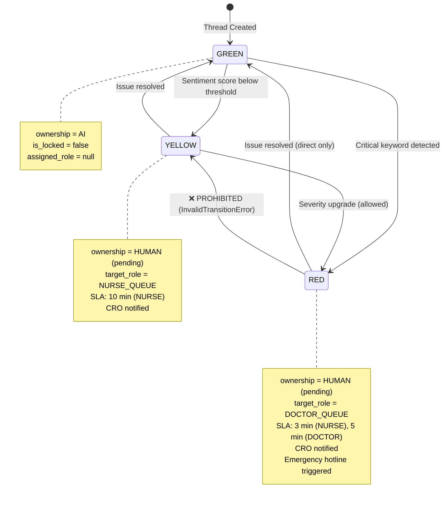
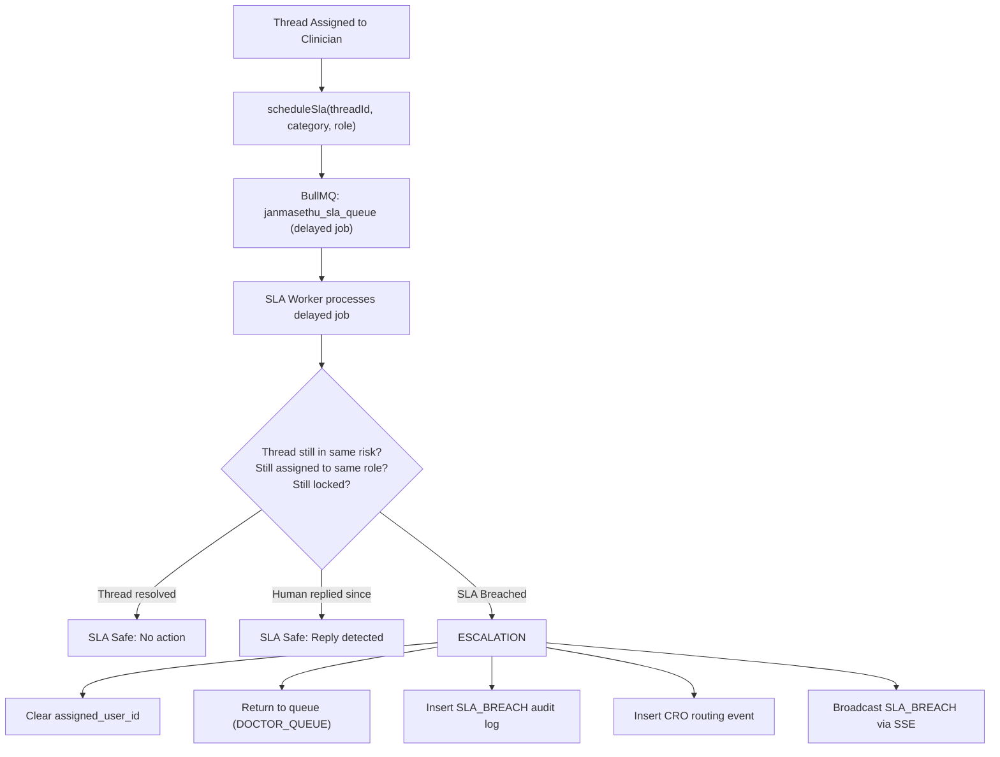
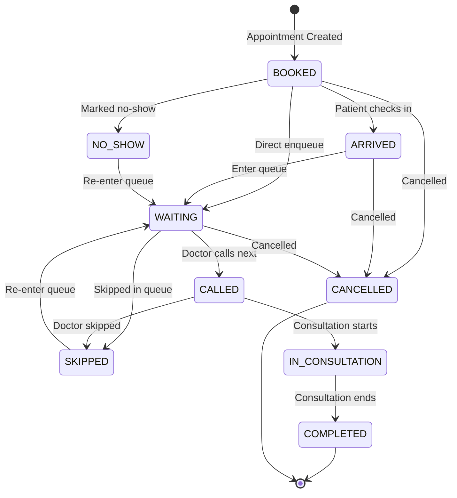
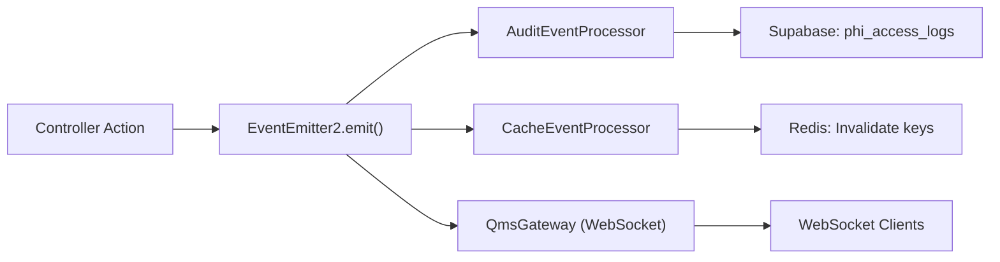
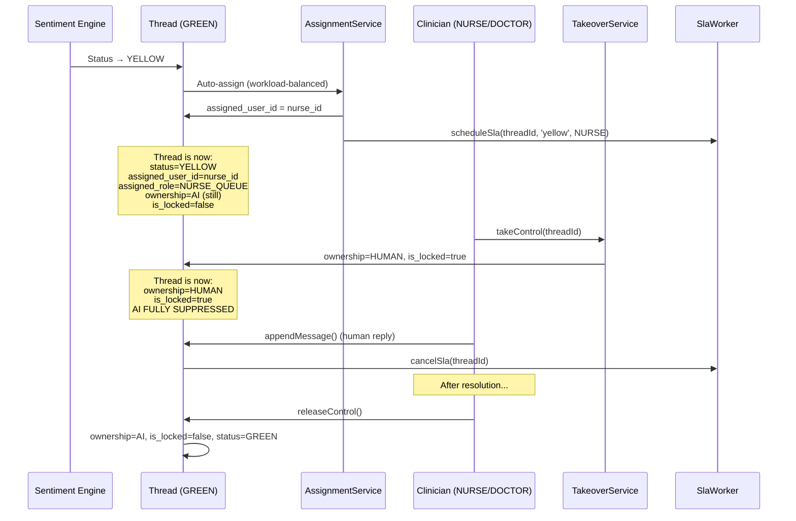

# DFO Backend — Domain Architecture

> **Version**: 2.0  
> **Last Updated**: 2026-08-18  
> **System**: DFO Control Tower Backend  
> **Domains**: Kernel · JanmaSethu · Clinics

---

## 1. Domain Boundary Map

The system is organized into three distinct bounded contexts:

```
┌─────────────────────────────────────────────────────────────────┐
│                         KERNEL (Domain-Agnostic)                 │
│                                                                  │
│  Contracts:  SentimentProvider · EscalationPolicy · DomainNotifier│
│  Core:       ThreadService · OwnershipService · RoutingService   │
│  Safety:     GuardrailService · AISuppressionGuard               │
│  Operations: AuditService · MetricsService · RateLimiterService  │
│  Registry:   ProviderRegistry (multi-domain plugin system)       │
│                                                                  │
│  ← Domain modules plug in via contracts, not direct coupling →   │
└───────┬──────────────────────────────────┬───────────────────────┘
        │                                  │
        ▼                                  ▼
┌───────────────────────┐    ┌──────────────────────────────────┐
│   JANMASETHU DOMAIN   │    │        CLINICS DOMAIN             │
│   (Maternal Health)   │    │    (Multi-Tenant Clinic SaaS)     │
│                       │    │                                    │
│  Implements:          │    │  Implements:                       │
│   SentimentProvider   │    │   Standalone (no kernel contracts) │
│   EscalationPolicy    │    │                                    │
│   DomainNotifier      │    │  Sub-Domains:                      │
│                       │    │   Auth · Patients · Appointments   │
│  Sub-Domains:         │    │   Documents · Leads · Staff        │
│   Risk Engine         │    │   Room Allocation · QMS            │
│   Clinical Intel      │    │   Dashboard · Analytics            │
│   SLA Enforcement     │    │   Patient Portal · Super Admin     │
│   Engagement Engine   │    │   Internal AI Assistant            │
│   Consent Management  │    │                                    │
│   Vitals Tracking     │    │                                    │
│   Alerting            │    │                                    │
│   Documents (DOCX)    │    │                                    │
│   Channel/Messaging   │    │                                    │
│   Analytics           │    │                                    │
│   Support Engagement  │    │                                    │
└───────────────────────┘    └──────────────────────────────────┘
```

---

## 2. Kernel Module — The Orchestration Engine

The Kernel is the **domain-agnostic core** that provides generic thread-based conversation orchestration. Domain modules (JanmaSethu, Clinics, future domains) plug into the kernel via **contracts** (TypeScript interfaces) without the kernel knowing anything about healthcare, maternal care, or clinic management.

### 2.1 Contracts (Plugin Interface)

```typescript
// src/contracts/index.ts

export interface SentimentProvider {
    evaluate(text: string, options?: { threadId?: string }): 
        Promise<{ score: number; label: string }>;
}

export interface EscalationPolicy {
    shouldEscalate(thread: Thread, evaluation: SentimentEvaluation): 
        Promise<boolean>;
    getRequiredRole(thread: Thread): string;
}

export interface DomainNotifier {
    notifyOwnershipSwitch(thread: Thread, actorId: string): 
        Promise<void>;
    notifyStatusChange(thread: Thread, previousStatus: string): 
        Promise<void>;
}
```

### 2.2 Provider Registry — Multi-Domain Support

```typescript
// Domains register themselves on module init:
this.providerRegistry.register('janmasethu', {
    sentimentProvider: this.riskService,
    escalationPolicy: this.escalationPolicy,
    domainNotifier: { ... }
});

// Kernel resolves domain-specific plugins at runtime:
const plugins = this.providerRegistry.getPlugins(thread.domain);
```

### 2.3 Core Types

```typescript
enum ThreadStatus { GREEN = 'green', YELLOW = 'yellow', RED = 'red' }
enum OwnershipType { AI = 'AI', HUMAN = 'HUMAN' }
enum Channel { WEB = 'web', MOBILE = 'mobile', API = 'api' }

interface Thread {
    id: string;
    domain: string;          // 'janmasethu', 'clinics', etc.
    user_id: string;
    channel: Channel;
    status: ThreadStatus;    // Traffic light: green/yellow/red
    ownership: OwnershipType; // Who controls the thread
    assigned_role?: string;   // Queue target (DOCTOR_QUEUE, NURSE_QUEUE)
    assigned_user_id?: string;// Specific assignee
    is_locked: boolean;       // Hard lock on AI
    version: number;          // Optimistic concurrency version
    metadata?: Record<string, any>;
}
```

### 2.4 Kernel Services Detailed

| Service | Key Methods | Behavior |
|:---|:---|:---|
| **ThreadService** | `initializeThread()`, `getThread()`, `appendMessage()`, `validateAIAction()`, `updateThreadStatusWithVersionCheck()` | Thread CRUD with optimistic locking. AI suppression check before every AI message. Audit log on every operation. |
| **OwnershipService** | `switchOwnership()`, `toggleLock()` | Atomic AI↔HUMAN transitions with version check. HUMAN ownership always sets `is_locked=true`. Validates transition legality (only AI↔HUMAN). |
| **RoutingService** | `routeToHuman()` | BullMQ-backed agent routing with dead-letter queue for unprocessable messages. |
| **SentimentService** | `evaluateThreadSentiment()` | Delegates to domain-specific `SentimentProvider`. Updates thread status based on score. |
| **GuardrailService** | `evaluate()` | Regex/keyword scanning. Auto-escalates on dangerous content. |
| **AuditService** | `append()` | Immutable audit log entries for every state transition. |
| **MetricsService** | `incrementConcurrencyConflictCount()`, `incrementOwnershipSwitchCount()` | In-memory counters for monitoring. |
| **RateLimiterService** | Per-thread rate limiting | Throttles requests per thread. |
| **ProviderRegistry** | `register()`, `getPlugins()` | Multi-domain plugin resolution at runtime. |

### 2.5 Optimistic Concurrency Control

```
Thread Version: N

Agent A (HUMAN)                    Agent B (AI)
switchOwnership()                  appendMessage()
    │                                  │
    ▼                                  ▼
UPDATE threads                     UPDATE threads
SET ... version=N+1                SET ... 
WHERE id=X AND version=N           WHERE id=X AND version=N
    │                                  │
    ▼                                  ▼
✅ Rows=1 → Success               ❌ Rows=0 → ConcurrencyException
   version → N+1                      metrics.incrementConflict()
                                       retry or abort
```

**Guarantee:** Two concurrent writers can never silently overwrite each other. The first writer wins, the second gets `ConcurrencyException`.

---

## 3. JanmaSethu Domain — Maternal Healthcare AI Platform

### 3.1 Module Composition

The JanmaSethu module is the largest domain with **~60 files** and **12 sub-modules**:

```mermaid
graph TD
    JM["JanmasethuModule"] --> Handler["JanmasethuHandler (Main Pipeline)"]
    JM --> Repo["JanmasethuRepository (38KB)"]
    JM --> ThreadOps["ThreadOperationsController + Repository"]
    
    JM --> RiskEngine["Risk Engine"]
    JM --> ClinicalIntel["Clinical Intelligence (Gemini AI)"]
    JM --> SLAWorker["SLA Enforcement (BullMQ)"]
    JM --> AssignmentService["Assignment Service (Load Balancing)"]
    JM --> TakeoverService["Takeover Service"]
    JM --> EngagementEngine["Engagement Engine"]
    JM --> ConsentModule["Consent Management"]
    JM --> VitalsModule["Vitals Tracking"]
    JM --> AlertingModule["Alerting + Webhooks"]
    JM --> DocumentModule["Document Generation (DOCX)"]
    JM --> ChannelModule["Channel/Messaging (WhatsApp)"]
    JM --> AnalyticsModule["Analytics"]
    JM --> AuthModule["JWT Auth"]
    JM --> SupportModule["Support Engagement"]
    
    JM --> Services["Core Services"]
    Services --> DFO["JanmasethuDFOService"]
    Services --> Leads["JanmasethuLeadsService"]
    Services --> Summary["JanmasethuSummaryService"]
    Services --> Reporting["JanmasethuReportingService"]
    Services --> Audit["JanmasethuAuditService"]
    Services --> RBAC["JanmasethuRbacService"]
    Services --> Encryption["JanmasethuEncryptionService"]
    Services --> Feedback["JanmasethuFeedbackService"]
    Services --> Context["JanmasethuContextService"]
```



### 3.2 Message Processing Pipeline (Handler)

The `JanmasethuHandler` is the core message processing pipeline:



### 3.3 Risk Engine (Hybrid Sentiment + Clinical Scoring)

The `JanmasethuRiskService` implements `SentimentProvider` with a **multi-signal scoring pipeline**:

```
Message Text
    │
    ├── KeywordDetector ─────── Emergency keywords (bleeding, severe pain, etc.)
    │                            → RiskLevel: RED/YELLOW/GREEN + tags
    │
    ├── SentimentAnalyzer ────── NLP-based sentiment score (0.0 - 1.0)
    │
    ├── ContextExtractor ─────── Thread history analysis (distress pattern count)
    │
    ├── Patient Profile ──────── Pregnancy stage (36+ weeks = 1.25x multiplier)
    │   Awareness                 Clinical risk category (high = 1.25x)
    │                            Trend detection (2+ yellows = 1.15x escalation)
    │
    └── RiskScoringEngine ────── Weighted composite score (0-100)
         │
         └── RiskClassifier ──── Final classification: green/yellow/red
```

**Profile-Aware Risk Amplification:**

| Factor | Multiplier | Trigger |
|:---|:---|:---|
| Late pregnancy (≥36 weeks) | ×1.25 | `pregnancy_stage >= 36` |
| High-risk profile | ×1.25 | `clinical_risk_category === 'high'` |
| Repeated medium-risk pattern | ×1.15 | 2+ yellow risk logs in last 3 assessments |

### 3.4 State Machine: Thread Status Lifecycle



**State Transition Actions:**

| Transition | Clear Assignment | Unlock Thread | Target Role | Cancel SLA | Notify CRO | Clear Alerts |
|:---|:---:|:---:|:---|:---:|:---:|:---:|
| GREEN → YELLOW | — | — | NURSE_QUEUE | — | ✅ | — |
| GREEN → RED | — | — | DOCTOR_QUEUE | — | ✅ | — |
| YELLOW → RED | ✅ | ✅ | DOCTOR_QUEUE | ✅ | ✅ | — |
| YELLOW → GREEN | ✅ | ✅ | null | ✅ | — | ✅ |
| RED → GREEN | ✅ | ✅ | null | ✅ | — | ✅ |
| RED → YELLOW | ❌ **BLOCKED** | — | — | — | — | — |

### 3.5 SLA Enforcement Engine



**SLA Timing Configuration:**

| Role | Yellow Thread | Red Thread |
|:---|:---|:---|
| NURSE | 10 minutes | 3 minutes |
| DOCTOR | — | 5 minutes |

**Escalation Chain:**
1. RED + NURSE timeout → Escalate to DOCTOR
2. RED + DOCTOR timeout → Page CRO (critical)
3. YELLOW + NURSE timeout → Standard SLA breach

### 3.6 Engagement Engine

The `EngagementEngineService` is a **rule-based event processor** that triggers proactive patient communications:

| Trigger Event | Action |
|:---|:---|
| `CONSULTATION_CLOSED` | Schedule follow-up reminder after consultation |
| `RISK_LEVEL_CHANGED` | Proactive outreach if risk increased |
| `PATIENT_INACTIVITY` | Re-engagement message after idle period |
| `APPOINTMENT_BOOKED` | Confirmation + reminder scheduling |
| `APPOINTMENT_COMPLETED` | Post-visit satisfaction check + follow-up care |
| `APPOINTMENT_MISSED` | No-show recovery outreach |
| `APPOINTMENT_CANCELLED` | Rebooking suggestion |
| `DOCTOR_CANCELLED_WITH_SUGGESTION` | Patient notification with alternative slots |
| `JOURNEY_PROGRESS_SYNC` | Milestone-based messages (Week 12: NT Scan, Week 20: Anatomy scan, etc.) |

**Consent Enforcement:** Every proactive message checks `engagement_preferences.opt_out_all` before dispatch.

### 3.7 Clinical Intelligence (Gemini AI)

The `ClinicalIntelligenceService` uses **Google Gemini 1.5 Flash** for AI-powered conversation analysis:

| Feature | Implementation |
|:---|:---|
| **Provider Modes** | `GEMINI` (live API), `MOCK` (test/dev), `CUSTOM` (injectable) |
| **Retry Strategy** | `async-retry` with exponential backoff |
| **Schema Validation** | Zod schema (`ClinicalInsightSchema`) validates AI output |
| **Audit** | Every analysis is logged with `AuditService` |
| **Encryption** | Insights stored with `EncryptionService` for PII protection |

### 3.8 Consent Management

Three-layer consent system:

1. **Conversational Consent Interceptor** (in `JanmasethuHandler`) — Intercepts first WhatsApp interaction, asks YES/NO before proceeding
2. **ConsentEnforcementService** — Validates every outbound communication against:
   - Allowed channels (WhatsApp, SMS, email, call)
   - Allowed message types (alert, update, reminder)
   - Quiet hours (e.g., 22:00-06:00)
   - Emergency override (critical urgency bypasses quiet hours)
3. **ConsentRepository** — Persists preferences per patient per clinic

---

## 4. Clinics Domain — Multi-Tenant Clinic Management SaaS

### 4.1 Module Composition

```mermaid
graph TD
    CM["ClinicsModule"] --> Controllers["21 Controllers"]
    CM --> Services["12 Services"]
    CM --> Guards["4 Guards"]
    CM --> Gateway["QMS WebSocket Gateway"]
    CM --> Processors["2 Event Processors"]
    CM --> AwsModule["AwsModule (S3)"]
    CM --> BullMQ["BullMQ: dfo_events_queue"]
    
    Controllers --> Auth["AuthController"]
    Controllers --> SuperAdminAuth["SuperAdminAuthController"]
    Controllers --> SuperAdmin["SuperAdminController"]
    Controllers --> PatientAuth["PatientAuthController"]
    Controllers --> PatientPortal["PatientPortalController"]
    Controllers --> Patients["PatientsController (56KB)"]
    Controllers --> Appointments["AppointmentsController (38KB)"]
    Controllers --> Documents["DocumentsController (31KB)"]
    Controllers --> Leads["LeadsController (26KB)"]
    Controllers --> Staff["StaffController"]
    Controllers --> RoomAlloc["RoomAllocationController"]
    Controllers --> Dashboard["DashboardController"]
    Controllers --> Audit["AuditController"]
    Controllers --> Users["UsersController"]
    Controllers --> QMSConfig["QMSConfigController"]
    Controllers --> QMSQueue["QMSQueueController"]
    Controllers --> Analytics["AnalyticsController"]
    Controllers --> Schedules["SchedulesController"]
    Controllers --> InternalAssistant["InternalAssistantController"]
    Controllers --> Knowledge["KnowledgeController"]
    Controllers --> ControlTower["ControlTowerController"]
    Controllers --> Clinics["ClinicsController"]
```



### 4.2 Sub-Domain: Authentication

| Endpoint | Actor | Method | Flow |
|:---|:---|:---|:---|
| `POST /api/auth/login` | Staff | Email + password hash | Verify → sign 7-day JWT |
| `POST /api/auth/logout` | Staff | — | Client-side token discard |
| `PUT /api/auth/profile` | Staff | Update profile | Validate + update user record |
| `PUT /api/auth/change-password` | Staff | Old + new password | Verify old → hash new → update |
| `POST /api/v1/superadmin/auth/login` | Super Admin | Email + password | Verify + is_super_admin check |
| `POST /api/v1/superadmin/auth/signup` | Super Admin | Email + password + secret | Validate secret code → create user |
| `POST /api/patient-auth/login` | Patient | Mobile + 4-digit PIN | bcrypt verify → lockout check → 1-hour JWT |

### 4.3 Sub-Domain: Appointment System

**State Machine:**



**QMS (Queue Management System) Engine:**

- Atomic enqueue via Supabase RPC (`enqueue_qms_patient`) — guarantees token generation + status update in one call
- Real-time queue updates via **WebSocket Gateway** (`QmsGateway` at `/qms` namespace)
- Predictive ETA engine based on real-time average consultation time per doctor
- Sweeper cron (every minute) auto-enqueues orphaned tokenless appointments older than 2 minutes

### 4.4 Sub-Domain: Room Allocation

```
Categories → Rooms → Beds → Admissions
     1:N        1:N      1:1 (occupied)
```

| Entity | Operations |
|:---|:---|
| **Room Categories** | CRUD with deactivation guard (can't deactivate with occupied beds) |
| **Rooms** | CRUD with soft delete, linked to category |
| **Beds** | CRUD within rooms, status: `available`/`occupied`/`maintenance` |
| **Admissions** | Create (double-book prevention), discharge, cancel, transfer |
| **Transfers** | Bed-to-bed transfer with atomic old-bed release + new-bed occupy |

**Daily Rate Snapshotting:** When a bed is assigned, the current daily rate is recorded at assignment time for accurate billing, regardless of future rate changes.

### 4.5 Sub-Domain: Internal AI Assistant

The `InternalAssistant` is a **locally-executed, LLM-free conversational interface** for clinic staff:

```
User Message → IntentClassifier (Regex) → Gatekeeper (RBAC) 
    → DataFetcher (Supabase Query) → Sanitizer (PII Filter) 
    → Responder (Natural Language) → ChatResponse
```

**Supported Intents:**
- Patient lookup by name/phone
- Appointment status queries
- Check-in patient (with confirmation flow)
- Mark appointment completed
- Mark patient no-show

**Security:** Uses a `PendingActions` token system for destructive operations — the assistant generates a confirmation token that expires, requiring explicit user confirmation before executing state changes.

### 4.6 Sub-Domain: Lead CRM

| Feature | Implementation |
|:---|:---|
| **Lead Lifecycle** | New → Follow Up → Consultation Done → Converted |
| **Bulk Import** | CSV upload → validation → batch insert |
| **CSV Export** | Filtered export with PII decryption |
| **Stalled Lead Processing** | Automatic identification of leads without activity |
| **Lead-to-Patient Conversion** | Atomic RPC (`convert_lead_rpc`) creates patient from lead data |
| **Re-engagement** | Automated outreach for stalled leads |

### 4.7 Event-Driven Side Effects



---

## 5. Ownership Transition Rules

### 5.1 Allowed Transitions

```
AI ←→ HUMAN (bidirectional)
AI → AI (no-op, allowed)
HUMAN → HUMAN (no-op, allowed)
```

Any other transition throws `BadRequestException`.

### 5.2 Ownership Lock Semantics

| Ownership | is_locked | Meaning |
|:---|:---|:---|
| AI | false | Normal AI-driven conversation |
| AI | true | Transitional state (should not persist) |
| HUMAN | true | **Active human takeover** — AI completely silenced |
| HUMAN | false | Should not occur — HUMAN always sets locked |

### 5.3 Assignment & Takeover Flow



---

## 6. JanmaSethu Data Types

### 6.1 Patient Journey Stages

```typescript
enum JourneyStage {
    TRYING_TO_CONCEIVE = 'trying_to_conceive',
    PREGNANT = 'pregnant',
    POSTPARTUM = 'postpartum',
    NOT_SPECIFIED = 'not_specified',
}
```

### 6.2 Escalation Rules

| Thread Status | Target Queue | Ownership | SLA (Nurse) | SLA (Doctor) |
|:---|:---|:---|:---|:---|
| GREEN | None | AI | — | — |
| YELLOW | NURSE_QUEUE | HUMAN (pending) | 10 min | — |
| RED | DOCTOR_QUEUE | HUMAN (pending) | 3 min | 5 min |

### 6.3 Clinical Entities

| Entity | Key Fields |
|:---|:---|
| `DFOPatient` | id, phone_number, journey_stage, pregnancy_stage, medical_history, engagement_preferences |
| `DFODoctor` | id, full_name, specialization[], is_available, work_hours |
| `DFOAppointment` | id, patient_id, doctor_id, status (FSM), reminders_sent |
| `DFOConsultation` | id, patient_id, doctor_id, thread_id, clinical_notes, diagnosis_tags[], status |
| `DFOPrescription` | id, group_id, medication_name, dosage, frequency, duration_days |
| `DFOMedicalReport` | id, patient_id, report_type, file_url |
