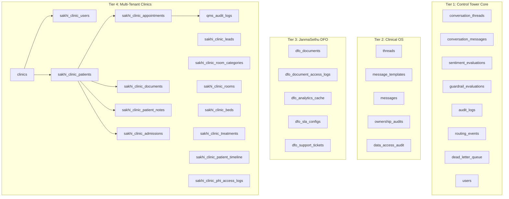
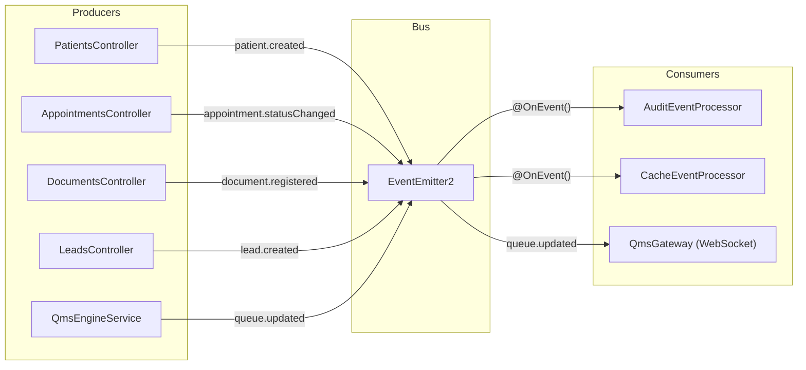
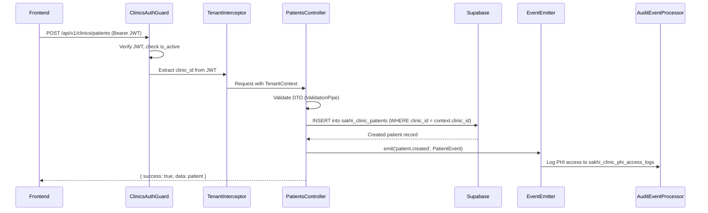
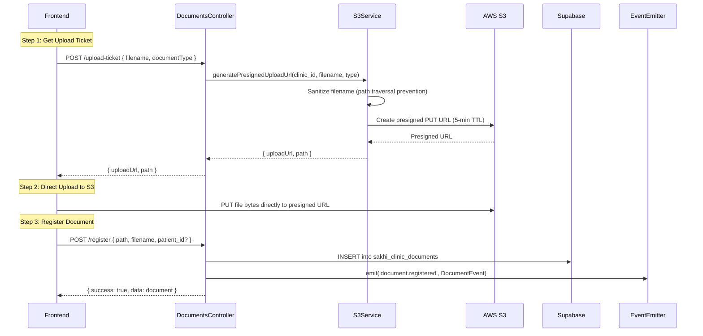
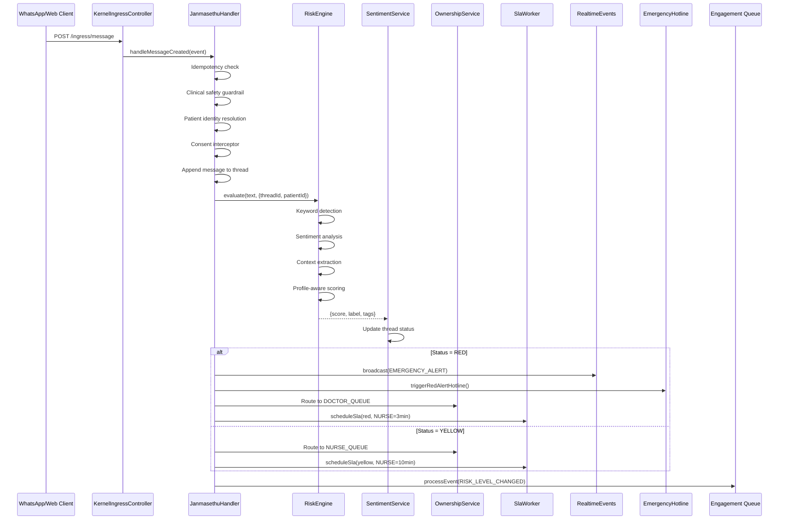

# DFO Backend — Infrastructure & Data Flow Architecture

> **Version**: 2.0  
> **Last Updated**: 2026-08-18  
> **System**: DFO Control Tower Backend

---

## 1. Infrastructure Component Map

```
┌─────────────────────────────────────────────────────────────────────┐
│                      INFRASTRUCTURE LAYER                            │
│                                                                      │
│  ┌─────────────────────────────────────────────────────────────┐    │
│  │  DatabaseModule (Global)                                     │    │
│  │  ├── SUPABASE_CLIENT (Primary)                              │    │
│  │  │   └── createClient(SUPABASE_URL, SUPABASE_SERVICE_KEY)   │    │
│  │  └── ORG_SUPABASE_CLIENT (Organization)                     │    │
│  │      └── createClient(ORG_URL, ORG_KEY) [fallback: primary] │    │
│  └─────────────────────────────────────────────────────────────┘    │
│                                                                      │
│  ┌─────────────────────────────────────────────────────────────┐    │
│  │  QueueModule (Global)                                        │    │
│  │  ├── BullMQ.forRootAsync (Redis connection)                  │    │
│  │  │   ├── Dev: InMemoryRedis mock config                     │    │
│  │  │   └── Prod: REDIS_HOST:PORT + TLS + password             │    │
│  │  └── Named Queues:                                           │    │
│  │      ├── routing_queue                                       │    │
│  │      ├── engagement_queue                                    │    │
│  │      └── reminder_queue                                      │    │
│  └─────────────────────────────────────────────────────────────┘    │
│                                                                      │
│  ┌─────────────────────────────────────────────────────────────┐    │
│  │  RedisCacheModule (Global)                                   │    │
│  │  ├── REDIS_CLIENT (ioredis instance)                        │    │
│  │  │   ├── Dev: optional REDIS_MOCK_CLIENT injection          │    │
│  │  │   ├── Retry: exponential backoff (min 50ms, max 2s)      │    │
│  │  │   └── Options: maxRetriesPerRequest=null, readyCheck=off │    │
│  │  └── RedisCacheService (get/set/del with TTL)               │    │
│  └─────────────────────────────────────────────────────────────┘    │
│                                                                      │
│  ┌─────────────────────────────────────────────────────────────┐    │
│  │  AwsModule                                                   │    │
│  │  └── S3Service                                              │    │
│  │      ├── generatePresignedUploadUrl (5-min TTL)             │    │
│  │      ├── generatePresignedDownloadUrl (1-hour TTL)          │    │
│  │      ├── uploadFile (direct buffer upload)                   │    │
│  │      └── deleteFile (soft-fail — logs but doesn't throw)    │    │
│  └─────────────────────────────────────────────────────────────┘    │
│                                                                      │
│  ┌─────────────────────────────────────────────────────────────┐    │
│  │  Context & Interceptors                                      │    │
│  │  ├── TenantInterceptor (APP_INTERCEPTOR)                    │    │
│  │  │   └── JWT → TenantState → AsyncLocalStorage              │    │
│  │  ├── TenantContext (static getters)                         │    │
│  │  └── TransformInterceptor (response wrapping)               │    │
│  └─────────────────────────────────────────────────────────────┘    │
│                                                                      │
│  ┌─────────────────────────────────────────────────────────────┐    │
│  │  Security                                                    │    │
│  │  ├── EncryptionService (AES-256-GCM)                        │    │
│  │  ├── AISuppressionGuard                                     │    │
│  │  ├── @Roles() decorator + RolesGuard                        │    │
│  │  └── @Permissions() decorator + PermissionsGuard            │    │
│  └─────────────────────────────────────────────────────────────┘    │
│                                                                      │
│  ┌─────────────────────────────────────────────────────────────┐    │
│  │  Repositories (Kernel)                                       │    │
│  │  ├── ThreadRepository    (conversation_threads)             │    │
│  │  ├── MessageRepository   (conversation_messages)            │    │
│  │  ├── SentimentRepository (sentiment_evaluations)            │    │
│  │  ├── RoutingRepository   (routing_events)                   │    │
│  │  └── DeadLetterRepository (dead_letter_queue)               │    │
│  └─────────────────────────────────────────────────────────────┘    │
│                                                                      │
│  ┌─────────────────────────────────────────────────────────────┐    │
│  │  Events                                                      │    │
│  │  ├── EventConstants (32 typed event names)                  │    │
│  │  └── EventPayloads (BaseEvent → Domain-specific payloads)   │    │
│  │      ├── DocumentEvent    (clinicId, documentId, payload)   │    │
│  │      ├── PatientEvent     (clinicId, patientId, payload)    │    │
│  │      ├── AppointmentEvent (clinicId, appointmentId, payload)│    │
│  │      ├── AdmissionEvent   (clinicId, admissionId, payload)  │    │
│  │      ├── LeadEvent        (clinicId, leadId, payload)       │    │
│  │      ├── StaffEvent       (clinicId, payload)               │    │
│  │      └── AuthEvent        (clinicId?, payload)              │    │
│  └─────────────────────────────────────────────────────────────┘    │
│                                                                      │
│  ┌─────────────────────────────────────────────────────────────┐    │
│  │  InMemoryRedisModule (Dev Only)                              │    │
│  │  └── Provides REDIS_MOCK_CONFIG and REDIS_MOCK_CLIENT       │    │
│  │      using redis-memory-server for local development        │    │
│  └─────────────────────────────────────────────────────────────┘    │
└─────────────────────────────────────────────────────────────────────┘
```

---

## 2. Database Architecture

### 2.1 Dual Supabase Client Pattern

The system supports **two independent Supabase instances**:

```typescript
// Primary Database — All clinical and operational data
@Inject('SUPABASE_CLIENT') supabase: SupabaseClient

// Organization Database — Platform-level data (with fallback)
@Inject('ORG_SUPABASE_CLIENT') orgSupabase: SupabaseClient
```

**Fallback Logic:** If `ORG_SUPABASE_URL` is not set, the organization client falls back to the primary Supabase instance. This allows single-database deployments during development.

### 2.2 Database Schema Tiers



### 2.3 Migration File Organization

37 sequential SQL migration files in `control-tower-core/db/`:

| Range | Category | Key Migrations |
|:---|:---|:---|
| `init-db.sql` | Foundation | Control tower core tables (threads, messages, audit, etc.) |
| `02_*` - `03_*` | Clinical OS | Clinical threads, messages, audit |
| `004_*` | DFO Documents | Document storage, access logs, analytics cache |
| `005_*` - `006_*` | Hardening | Analytics, support tickets |
| `007_*` | Multi-Tenancy | Clinics, users, patients, appointments, documents, leads |
| `008_*` - `012_*` | Portal & Auth | Patient auth, staff bridge, document status, columns |
| `013_*` | Indexing | Compound indexes for tenant isolation |
| `014_*` - `017_*` | Room Allocation | Categories, rooms, beds, admissions, transfers |
| `018_*` | Timeline | Patient timeline events |
| `019_*` | Schedules & Metrics | Doctor schedules, medical metrics |
| `020_*` | Users & PHI | Extended profiles, PHI access logs |
| `021_*` - `024_*` | RPCs | Atomic clinic creation, orphan cleanup, lead conversion, soft delete |
| `025_*` - `030_*` | Refinements | Active status, soft deletes, RLS, QMS tokens, leads conversion |

---

## 3. Redis Architecture

### 3.1 Connection Configuration

```typescript
// Production connection
new Redis({
    host: REDIS_HOST,
    port: REDIS_PORT,
    password: REDIS_PASSWORD || undefined,
    tls: REDIS_TLS === 'true' ? {} : undefined,
    maxRetriesPerRequest: null,      // BullMQ requirement
    enableReadyCheck: false,          // Faster startup
    retryStrategy(times) {
        return Math.min(times * 50, 2000); // Exponential backoff, max 2s
    },
});
```

### 3.2 Redis Usage Patterns

| Consumer | Pattern | Keys/Queues |
|:---|:---|:---|
| **BullMQ** | Job Queues | 8 named queues (routing, engagement, reminder, SLA, etc.) |
| **RedisCacheService** | Key-Value Cache | Staff lists, analytics aggregations |
| **StaffCacheService** | TTL Cache | Staff list per clinic with Redis-backed caching |
| **InMemoryRedisModule** | Mock (Dev) | `redis-memory-server` + `ioredis-mock` for local development |

### 3.3 BullMQ Job Processing Model

```
Producer (Service)               Redis              Consumer (Worker)
     │                            │                       │
     │  queue.add(jobName, data)  │                       │
     ├───────────────────────────►│                       │
     │                            │ BRPOPLPUSH            │
     │                            ├──────────────────────►│
     │                            │                       │
     │                            │   process(job)        │
     │                            │◄──────────────────────┤
     │                            │                       │
     │                            │  Complete/Failed      │
     │                            │◄──────────────────────┤
```

**Job Configuration Defaults:**
```typescript
{
    attempts: 3-5,
    backoff: { type: 'exponential', delay: 1000 },
    removeOnComplete: true,
    removeOnFail: false,  // Keep failed for inspection
}
```

---

## 4. Event System Architecture

### 4.1 In-Process Event Bus (EventEmitter2)

The system uses NestJS `EventEmitterModule` for synchronous in-process events:



### 4.2 Event Payload Hierarchy

```
BaseEvent
├── clinicId: string
├── actorId: string | null
└── timestamp: string (ISO 8601)

DocumentEvent extends BaseEvent
├── documentId: string
└── payload?: Record<string, any>

PatientEvent extends BaseEvent
├── patientId: string
└── payload?: Record<string, any>

AppointmentEvent extends BaseEvent
├── appointmentId: string
└── payload?: Record<string, any>

AdmissionEvent extends BaseEvent
├── admissionId: string
└── payload?: Record<string, any>

LeadEvent extends BaseEvent
├── leadId: string
└── payload?: Record<string, any>

StaffEvent extends BaseEvent
└── payload?: Record<string, any>

AuthEvent extends BaseEvent (clinicId nullable)
└── payload?: Record<string, any>
```

### 4.3 Real-Time Events (SSE + WebSocket)

**Server-Sent Events (JanmaSethu):**

`RealtimeEventsController` provides SSE endpoints for dashboard real-time updates:

| Event Type | Trigger | Data |
|:---|:---|:---|
| `EMERGENCY_ALERT` | Thread reaches RED status | threadId, patientId, message excerpt, score, tags |
| `SLA_BREACH` | SLA timer expires without response | threadId, previous_role, reason, risk level |

**WebSocket (Clinics QMS):**

`QmsGateway` at namespace `/qms` provides real-time queue updates:

| Client Event | Server Event | Description |
|:---|:---|:---|
| `join_queue_room` | `joined` | Client joins doctor-specific room |
| `leave_queue_room` | `left` | Client leaves room |
| — | `queue_updated` | Broadcast when queue status changes |

Room naming: `tenant_{tenantId}_doctor_{doctorId}`

---

## 5. Data Flow Diagrams

### 5.1 Patient Registration Flow (Clinics)



### 5.2 Document Upload Flow (S3)



### 5.3 Message Ingestion Pipeline (JanmaSethu)



---

## 6. Cron Jobs & Background Workers

| Job | Schedule | Module | Behavior |
|:---|:---|:---|:---|
| **QMS Sweeper** | Every minute | `QmsEngineService` | Auto-enqueue orphaned tokenless appointments (>2 min old) |
| **No-Show Scanner** | Every hour | `JanmasethuModule` | Scan for no-show appointments and trigger engagement |
| **SLA Check** | Delayed (per-thread) | `JanmasethuSlaWorker` | Process delayed SLA breach jobs |
| **Backend Stabilization** | On startup | `JanmasethuMaintenanceService` | Health checks, queue cleanup, seeding |

---

## 7. WebSocket Architecture

### 7.1 QMS Gateway

```
Client (Browser) ←─── Socket.IO ───→ QmsGateway (NestJS)
     │                                      │
     │  emit('join_queue_room',             │
     │       {tenantId, doctorId})          │
     │─────────────────────────────────────►│
     │                                      │ Join room:
     │                                      │ tenant_{id}_doctor_{id}
     │                                      │
     │     ←── 'queue_updated' broadcast ───│
     │           {status, token, ...}       │
     │                                      │
     │  @OnEvent('queue.updated')           │
     │  triggered by QmsEngineService       │
```

**Configuration:**
```typescript
@WebSocketGateway({
    cors: { origin: '*' },
    namespace: '/qms'
})
```

---

## 8. Error Handling & Resilience

### 8.1 Retry Strategies

| Component | Strategy | Config |
|:---|:---|:---|
| **BullMQ Jobs** | Exponential backoff | 3-5 attempts, 1s base delay |
| **Redis Connection** | Linear backoff | min(times × 50ms, 2000ms) |
| **Gemini AI** | `async-retry` | Exponential backoff with configurable attempts |
| **S3 Operations** | No auto-retry | Errors logged, deleteFile soft-fails |
| **Supabase Queries** | No auto-retry | Errors propagated to caller |

### 8.2 Graceful Degradation

| Failure | System Behavior |
|:---|:---|
| **Redis unavailable** | Dev: InMemoryRedisModule provides mock. Prod: BullMQ retries connection. |
| **Gemini API key missing** | `ClinicalIntelligenceService` runs in `MOCK` mode with deterministic responses |
| **S3 credentials missing** | Warning logged on startup; upload/download fail gracefully with error messages |
| **Supabase unreachable** | Auth guard returns `503 Service Unavailable` instead of `401` |
| **Encryption key missing** | `EncryptionService` throws on first use; system won't start without it |
| **Decryption failure** | Returns original (possibly unencrypted) text — graceful for legacy data |

### 8.3 Dead Letter Queue

The Kernel provides a `DeadLetterRepository` for messages that fail all retry attempts:

```
Failed Job → BullMQ maxAttempts exceeded → Dead Letter Queue
                                              │
                                              ▼
                                    dead_letter_queue table
                                    (thread_id, payload, error, created_at)
```
